# 1. Python Theory Questions
1. What is Python and what are its main features? 
Answer: Python is an object oriented programming language. Its main features are that it is not a strongly typed language (one does not need to declare the type of a variable when declaring a variable), it is dynamically typed instead (meaning the program will attempt to guess what type is the variable) and it is fairly similar to human speech which gains it the label of being more understandable to beginners (more readable). It does not need to be compiled (by a human, manually. Like with Java, it is compiled to bytecode by a virtual machine, without human interference or request – fun fact – it can actually be compiled to Java bytecode via JVM in order to access not only the Python modules, but also the Java classes & libraries), it is interpreted. It also has in-built garbage collecting & cleaning mechanism GIL.
Additionally, according to Python.org one of its main features is that it has an in-build debugger, which allows for faster code-test-debug flow together with the fact you don’t need to compile the code in order to run it.
Source: python.org (mostly wrote from my head/memory).

2. Discuss the difference between Python 2 and Python 3?
Answer: The only difference I personally knew was that switch case was added in Python 3 (in Python it’s “match case”) because previously I was searching for this function in Python (knew it from Java) and the article describing its used said it was implemented in Python 3, so prior to that it seemingly was not featured. Everything else is knowledge I’ve Googled: 
    1. syntax: Python3 - print (“hello”) versus Python2 - print “hello”
    2. integer division result: Python3 – float versus Python2 – integer
    3. Unicode text: Python3 – text in Unicode per default versus Python2 – strings needed to be marked with “u” to be considered as Unicode.
    4. iteration: Python3 – uses range() versus Python2 – uses xrange()
    5. exceptions: Python3 – enclosed in parenthesis versus Python2 – in notations
    6. legacy: can port Python2 in Python3, but can’t port Python3 in Python2
    7. libraries: possibly more of them in Python3, new ones created mainly for Python3, libraries created for Python2 not compatible with Pyton3
    8. basically the answer on the internet is that Python3 is easier to understand, has more libraries and features, is widely used, and most importantly, is still being developed while Python2 was discontinued 2 years ago.
Source: https://www.guru99.com/python-2-vs-python-3.html

3. What is PEP 8? 
Answer: It stands for “Python Enhancement Proposal”, there are several of them, and it’s a code style guide for Python, meaning a collection of best practices for Python code styling (how to write/style the Python code). Style is important because it increases the code readability. What for example is meant by code styling: whether one uses indentations or not, whether one uses no enclosure, enclosure with ‘’ or “” or () or {} or [], whether one uses spacing, blank (new enter) lines, whether one uses snake_case or CamelCase. For one small example of what this means in practice and why it is important in practice, in Java, even without the typing we might understand a variable is a string if the value of it is enclosed in double apostrophe (quotation marks) “like this”, and in Python, test (string value) should be enclosed in double or single apostrophe, ‘like this’ or “like this”. If you see a variable with a value with no apostrophes in Python, you can understand it is not a string. It’s a bit like grammar or orthography in human language – even if you do spaces wrong in your code, it will run and it will be understandable, but it will be less readable, look odd. It’s best practice which makes life easier by making the code more readable to adhere to clean code practices.
The really cool thing about modern programming is that we now have tools like IDE which do the “spell check” for us and highlight possible “orthography” and “grammar” (syntax & style) mistakes for us to consider correcting. Over 10 years ago as a beginner with HTML and CSS there were no fancy IDEs and I was oblivious to the fact of existence even of the simple tools like Notepad++ and used a regular notepad for coding all my websites. Can’t say it did me wrong, but my life could have been so much easier. With IDEs like VisualStudio Code, PyCharm and IntelliJ life is so easy :)
I’ve read through these pages, but I won’t quote all the rules, most of them already felt familiar after Java :) (Sources:) https://peps.python.org/pep-0008 https://realpython.com/python-pep8 

4. In computing / computer science what is a program?
Answer: A program is basically an instruction for the computer which tells it what to do, how, where and when to do it. It’s an instruction which is written for the computer, interpreted, read and executed by the computer. It can be an operating system or an application. And by a computer we mean any device with a programmable computer, not necessarily just personal computers like PCs or laptops. Servers and washing machines are also programmable and execute programs – one can program the washing machine to perform the laundry according to the type of clothing input – one chooses from a pre-programmed, closed set of options, can set the temperature and type of fabric, and run the program so that the washing machine executes it (does the laundry according to instructions). This can even be done remotely with nowadays laundry machines which come with their own mobile applications.
What is important here, the program has to be written in a language which the computer (machine) can “understand”, read and execute the command/instruction. Computer science employs a range of programming languages for different purposes and machines, not every machine reads every language. Depends on the attributes of the machine (type and size of memory and processing power – mobile phones used to have a separate type of OS, washing machines also have different OS from PCs and laptops) and the OS installed on the machine (a Windows application will not run on a Macintosh OS computer, despite its intended for computers, but due to incompatible OS it won’t be read and executed).
Source: https://www.learncomputerscienceonline.com/what-is-computer-program 

5. In computing / computer science what is a process? 
Answer: A process is an instance of a program that runs (is being executed) on the computer using its computing memory. In Windows if you open the Task Manager, an application that lists all the currently running programs, it lists them as processes and if you want to end one of them, it asks if you want to “kill the process”. The processes exist in one of 5 stages of a process lifecycle: start, ready, running, waiting, and terminated; which are leveraged to allow better CPU allocation.
Sources: https://en.wikipedia.org/wiki/Process_(computing) https://www.baeldung.com/cs/job-vs-task-vs-process 

6. In computing / computer science what is cache? 
Answer: In Polish we call it “handy memory” or “at hand memory” – it’s one of the types of computing memory on the computer – in order to enable faster processing of data, so faster work of the computer, it has a kind of a handy notepad for the most recent and most commonly accessed data – if it is frequently accessed, it makes work faster if we do not need to go all the way to where the data is stored and open it up each time to access it, but use the handy shortcut of this data we have in cache. Cache is a temporary memory – it’s not for long time storage, but for frequent access and short time storage. As far as I know, the word “cache” in English actually pretty much carries the meaning of what this memory’s core function is, PL name is more descriptive.
Might be worth to mention that cache is not only 1 per computer –  some people might be inclined to think that 1 computer has 1 cache, namely the RAM memory (rapid access memory, if I remember correctly) – however, cache is also employed by the computer’s subsystems, browsers have their temporary files, which is their cache of operating, rapid access memory, and due to their voraciousness, graphics cards also have their own cache memory, so as to unburden their demands on the computer’s memory and computing resources.
Sources: https://computer.howstuffworks.com/computer-memory.htm https://www.quora.com/What-is-the-concept-of-caching-in-programming 

7. In computing / computer science what is a thread and what do we mean by multithreading? 
Answer: This is complicated and the best description I’ve encountered was in CodeCademy, so I’ll just quote it: “A thread represents the actual sequence of processor instructions that are actively being executed. Each process contains at least one thread and can contain many such structures that all share resources among each other to allow for faster communication and context switching between them. This all allows them to be “lighter” and require fewer system resources. With the hardware advancement of multithreading, individual cores can also execute multiple threads at once, further improving system utilization and responsiveness by more efficiently splitting up tasks.   Threads behave differently depending on the environment they were created in. Kernel threads are constructed through system calls to the kernel while user threads are constructed using local function calls. User threads, therefore, allow for more fine-grained control by developers that can be more efficient than their kernel counterparts. However, these user threads have to be mapped to their kernel counterparts in order to be actually executed.”
In my words attempt: 1 process has at least 1 thread, but usually more. 1 process can be for example a Word.exe running. It can concurrently run several threads: one for tracking the cursor & clicks, one for keyboard input, one for auto saving etc. A thread is an end-to-end task, doing 1 particular thing, while a process is a complex instance of a program that requires multiple threads to execute. Execution of multiple threads concurrently is multithreading.
Source: https://www.baeldung.com/cs/multiprocessing-multithreading 

8. In computing / computer science what is concurrency and parallelism and what are the differences? 
Answer: Concurrency is when we are running several tasks/processes/threads on one and the same CPU – pretty much just like with humans with 1 single brain, 1 computer with 1 single CPU can only process 1 single task at any given time – the fact that we can speak of multitasking in both cases only accounts for the ability to promptly switch between the tasks. I can listen to music while typing this text, but what in fact happens is, I concentrate on typing and when I listen to lyrics, I briefly switch my attention to the song text. Computers are fast enough to allow for seamless switching, so that multi-threading is performed (switched from task to task) so fast, that it seems like a computer is doing several things at the same time, when in fact it’s performing one task after another in overlapping time periods, just that performing a task takes a split second, and switching also takes a split second, making it seamless. 
Parallelism is when in the same time the computer truly performs more than 1 task (at the exact same time) – but that can’t be done using the same CPU. With more than 1 CPU (i.e. a multi-core processor) a thread/task/job/process can be delegated to the other CPU or other CPUs and performed (run) at the exact same time as another task on CPU 1.
Quote: “Differences between concurrency and parallelism: 
    • Concurrency is when multiple tasks can run in overlapping periods. It’s an illusion of multiple tasks running in parallel because of a very fast switching by the CPU. Two tasks can’t run at the same time in a single-core CPU. Parallelism is when tasks actually run in parallel in multiple CPUs.
    • Concurrency is about managing multiple instruction sequences at the same time, while parallelism is running multiple instruction sequences at the same time.
    • In Python, concurrency is achieved by using threading, while parallelism is achieved by using multitasking.
    • Concurrency needs only one CPU Core, while parallelism needs more than one. 
    • Concurrency is about interruptions, and parallelism is about isolation.”
Sources: https://www.baeldung.com/cs/concurrency-vs-parallelism ; https://oxylabs.io/blog/concurrency-vs-parallelism ; https://www.geeksforgeeks.org/difference-between-concurrency-and-parallelism

9. What is GIL in Python and how does it work? 
Answer: GIL is a mutex/process lock which disallows multithread execution – it only allows 1 thread to be executed at any given time, enforces single thread execution. It works by forcing single thread execution on Python programs, even multi-thread ones, because Python has a variable reference counter which is used for memory management – when the counter of total reference number of an object reaches zero, the memory assigned to it is freed up. With multi-thread execution enable there’s a risk of this feature of Python (reference counter) getting messed up (counting the same variable several times in threads running concurrently) – it caused leaked memory which was never released (never reached zero to be released, because the counter was upped by the multi-threading) and Python crashes.
Sources: https://realpython.com/python-gil ; https://www.geeksforgeeks.org/what-is-the-python-global-interpreter-lock-gil ; https://www.javatpoint.com/what-is-gil-in-python-global-interpreter-lock 

10. What do these software development principles mean: DRY, KISS, BDUF 
Answer: 
- DRY stands for “don’t repeat yourself” and its key idea is non-duplication – it underlines the importance of each piece of knowledge/command having only 1 representation, in 1 place. If 1 thing is defined in more than 1 place, when we want to make changes to it, it makes life harder cause we must then make sure to correctly coordinate all of the occurrences of this definition to ensure it’s not suddenly in conflict with the newly implemented rule/update. “Every piece of knowledge must have a single, unambiguous, authoritative representation within a system.” - the Pragmatic Programmer. https://thevaluable.dev/dry-principle-cost-benefit-example
- KISS stands for “Keep It Simple, Stupid”, and it’s a neat design idea stemming from US Navy in the 60s (according to wiki). The idea is to keep all and any things as simple as possible – the simpler, the better. Avoid unnecessary additions, waterworks, fireworks, decoration – this is clutter. It’s another iteration of the idea that “if you can’t explain something simply, you don’t understand it well” in my opinion. Simplification is the utmost sophistication, even ancient philosopher said that things are perfect not when not more things can be added, but no more things can be detracted from our “thing”. It’s easy to over-complicate and add unnecessary things, but harder to prioritise, realise what is really necessary and needed, and how to write it succinctly, shortly, precisely, in a clear way. I don’t really like the modern iterations of this principle which try to cover the last S standing for “stupid” with something else – like “Keep It Super Simple” for graphics design – I personally feel it is really useful to stigmatise over-complication this little bit, as it makes life harder for everyone and is just unwise, this word, “stupid”, fits well. I prefer the original name of this principle, minimalism is good and clear – also good for the person who will read my code, who is not me, and does not know my code – it’s good to write with other people & readability on mind, and it is really unwise to write code in a convoluted, cryptic way that only I will understand. That’s counterproductive. 
- BDUF “Big Design Up Front” – an idea saying that the full design of the program should be readied before work on the implementation begins. That sounds very waterfall alike. What if the client changes their mind? Market changes and we need a new option/functionality added? I think agile approach is better for programming. From what I heard from friends it’s a rarity that a client would not have any changes to the project on the go, or that they would clearly define their needs at day 1. This BDUF seems like a good idea, ideally, and that’s how I try to do things – i.e. plan a trip or something – but when some changes comes around to be implemented or just befalls us, we must adapt. Maybe then BDUF again with that change and start implementing again. A bit of agile approach, adapt, and back to waterfall BDUF. Depends on the situation and the project I guess, if it is possible to make the A-Z design and then implement it – sure, that’s better, faster, cheaper, less problematic. Maybe in reality not many things can be done so – my manager friend said waterfall is mostly used in things like construction, we know what we want to build, and there are not as many unknowns, changes (a completely new type of windows every 2 years or so, or client suddenly switching their mind from concrete to wood), so it’s more possible to plan everything A-Z in steps and then implement it in steps accordingly. From what I’ve heard from friends in IT and also from my Scrum courses, in IT, agile seems to be a better fit than waterfall approach, but of course both approaches have pluses and minuses. 
Source: https://www.freecodecamp.org/news/the-pros-and-cons-of-big-design-up-front-and-what-i-do-instead-375f00542dec/

11. What is a Garbage Collector in Python and how does it work? 
Answer: Simply put garbage collection is when the previously allocated memory which is no longer necessary (in use, referenced) is removed (wiped, freed up, stops being occupied by the program which first allocated some object to that memory). Python has an in-built garbage collection in form of this reference counter (see the above answer #9 about GIL for more details), but also had a referencable garbage collector which can be enabled or disabled, set debugging options and the collection frequency for garbage that the reference counter cannot free up. 
Source: https://docs.python.org/3/library/gc.html

12. How is memory managed in Python? 
Answer: Mainly automatically, via the in-built and automated reference counter. One can also perform a manual garbage collection using the garbage collector described in the above answer #11. I’m not sure if this should be mentioned here or not, but Python also uses heap (dynamic) and stack (static) memories (this just doesn’t seem a feature unique to Python or anything special). The same garbage collection rules still apply.
Sources: https://www.geeksforgeeks.org/memory-management-in-python ; https://realpython.com/python-memory-management ; https://www.javatpoint.com/python-memory-management 
13. What is a Python module? 
Answer: A module is a Python file (a .py file with code in Python written in it) which can contain definitions, functions and executable statements – a code which solves a commonly encountered issue, which was already written before, and instead of reinventing the wheel by trying to code to calculate something or decrypt something, we can import the module that already does that from the library of Python modules. The point of using modules/libraries/packages is to save time, make life easier, avoid mistakes other programmers have already encountered, been through and resolved – the module/library/package can be seen as the knowledge gathered from that experience, expressed in code. The files in that library/module/package already are the ready-made answer, solution to a given problem, they allow us to do the thing we want by simply importing the solution which works, instead of trying to invent it by ourselves. They are very useful. The difference between a module and a package is, a package contains more than 1 file (at least 2 – the module file and the init.py file), and 1 module is 1 .py file, where that file name is the module name.
Sources: https://docs.python.org/3/tutorial/modules.html ; https://stackoverflow.com/questions/7948494/whats-the-difference-between-a-python-module-and-a-python-package 

14. What is docstring in Python? 
Answer: It’s apparently a special type of comment. It is made (declared) by enclosing the to-be comment text with either ‘’’triple apostrophes’’’ or with “””triple quotation marks”””. In order to be a docstring, such a comment should be placed atop a definition in a Python module, right below the function’s definition line. It’s purpose is to describe what the function does (not how), and all functions defined in Python modules should have the docstring comments. Unlike comments, there are style expectations here – a docstring should be styled as a full sentence (beginning with a capital letter and ending with a fullstop) and also unlike comments, we can actually call a docstring via its function to print its content by referencing “__doc__” (so we can ask the function what it does in this way).
Source: https://www.geeksforgeeks.org/python-docstrings 

15. What is pickling and unpickling in Python? Example usage. 
Answer: Pickling is when one converts data from Python to a byte stream. So from a Python object such as a boolean variable we convert to a byte stream. The conversion is done in such a way that also saves the information about the object data type in the byte stream, so when unpickling, we can get the Python object of correct, unchanged type (our boolean will be boolean, not a string). Unpickling is the opposite process of pickling, so instead of converting Python objects to byte stream of characters, it converts the pickle of the byte stream characters into the respective Python objects. Safety warning: do not use unpickling for pickles from unknown vendors, errors and malicious code might ensue.
Quote: “The following types can be pickled & unpickled : 1 - None, True, and False ; 2 - integers, floating point numbers, complex numbers ; 3 - strings, bytes, bytearrays ; 4 - tuples, lists, sets, and dictionaries containing only picklable objects ; 5 - functions defined at the top level of a module (using def, not lambda) ; 6 - built-in functions defined at the top level of a module ; 7 - classes that are defined at the top level of a module ; 8 - instances of such classes whose __dict__ or the result of calling __getstate__() is picklable”
Sources: https://medium.com/analytics-vidhya/pickling-and-unpickling-in-python-explained-be546e604aae ; https://docs.python.org/3/library/pickle.html ; https://www.geeksforgeeks.org/pickle-python-object-serialization 

EXAMPLE USAGE 1 – pickling:

    import pickle
    
    
    def pickle_data():
        data = {
                    'name': 'Prashant',
                    'profession': 'Software Engineer',
                    'country': 'India'
            }
        filename = 'PersonalInfo'
        outfile = open(filename, 'wb')
        pickle.dump(data, outfile)
        outfile.close()
    
    
    pickle_data()

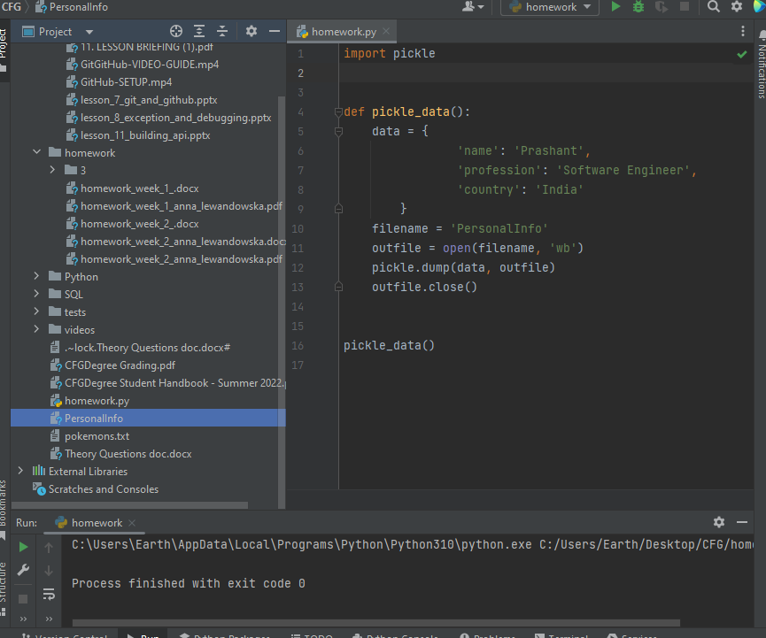

EXAMPLE USAGE 2 – unpickling the pickle created in example #1:

    import pickle
    
    
    def unpickling_data():
        filename = 'PersonalInfo'
        file = open(filename, 'rb')
        new_data = pickle.load(file)
        file.close()
        return new_data
    
    
    print(unpickling_data())

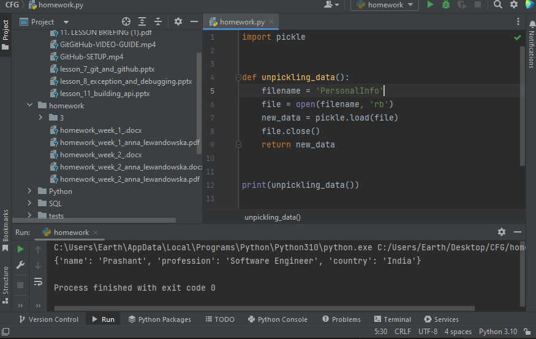

16. What are the tools that help to find bugs or perform static analysis? 
Answer: The most popularly named tools for bug finding and static analysis I have found were PyChecker, Pylint, pyflakes and MyPy. I haven’t used them yet so I do not have opinions on them, but I read what they do and how to use them. 
Sources: https://www.tutorialspoint.com/what-are-the-tools-that-help-to-find-bugs-or-perform-static-analysis-in-python ; http://net-informations.com/python/iq/bugs.htm ; https://www.quora.com/What-are-the-tools-that-help-to-find-bugs-or-perform-static-analysis ; https://blog.codacy.com/which-python-static-analysis-tools-should-i-use 

17. How are arguments passed in Python by value or by reference? Give an example.
Answer: Short answer: by reference, except when the data is of an immutable type, then it behaves as if it was passed by value.
Long answer: It’s a great question, had to answer it for Java, interesting to know that it works differently in Python. Let’s start with what it means. 
“By reference” means a reference, link, “address” to/of an object and its value is provided – the value of the linked/referenced object can be then accessed, viewed, printed out and also modified. 
“By value” means we don’t provide the link to an object, only a copy of its value. 
So with simple but an abstract example, if we have a variable “name” with value “anna”, using the “by reference” way we provide “a variable called “name” with value “anna” which is stored at 52nd location in memory”, and using “by value” way we provide “a value “anna” from variable “name”“ - we don’t know/care where it is located, and its name is not important, we have a copy of the value which we can work on. This is just to try to explain in simple words what is the difference between “by reference” and “by value”.
The implications of this are that when working on “by reference” item, we work directly on that item, so any operations on that variable will be applied to the actual object we reference, and when working on “by value” we only work on the value which is actually copied, we do not work on the actual object – so we can perform actions, append something to that name, and this will result in a new object, and the original object “name” will still retain its original value “anna”.  

(This is an animated .gif, I attach it also as a separate file as in .pdf it will be static)
Then it gets a bit more complicated, especially due to the a bit misleading lingo – in Java calling an object is often called “referencing” an object, while Java is actually strictly “by value”. If for example I’d work on some integer “x” by value 2 in Java and I would pass it onto some function foo() which would alter its value, inside the function the copy of integer x would be worked on, and its value might be altered (for example, x+1 would lead to changing value of integer x to 3) – but that would only apply to the integer x inside the scope of that function foo() - outside of that function, integer x would still remain unchanged, with value 2. So Java does not work on references, but on copied values.
(It’s interesting what’s going on with string type values here, because a/ they are immutable and b/ in Java if they have an exact same value, i.e. we have 2 variables of string type with both value “anna”, they will actually be stored in 1 and exact same place in memory, with exact same object ID, which has funny implications when object comparing, but ad rem...)
In Python, apparently “both” or “neither” - “In Python, “Object references are passed by value”.” “Python uses pass-by-object-reference.” - it seems to be mighty close to “by reference”, and the most important distinction here is, that some data types are immutable (for example strings and tuples), and then it behaves like “by value”, but apparently that does not necessarily mean these values were passed on as copies, but just that because these data types are inherently immutable, outside of the function to which they were borrowed, the original value of the variable/data object will not be changed (because it is immutable).
    listA = [0] 
    listB = listA
    listB.append(1)
    print(listA)
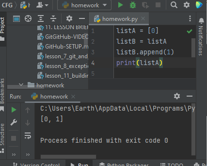
^ we assign the values from listA to listB, and now listB has values of listA.If this was passed “by value”, then listA would have remained unchanged, with 1 item equal 0. But, this is Python, so it’s either passed “by reference” or the “pass-by-object-reference”, so when we add number 1 to listB (not to listA!) and then we print listA, we get the result [0, 1] –  listA is also affected by our operations performed on listB, we work on the object, not just on its values.
It is crucial to note that in the above example where Python behaves as “by reference” we use lists, and lists are mutable data types. For immutable data types such as for strings or tuples, obviously Python would not change the original object, because it is immutable. For mutable objects there seems to be no difference between Python handling and “by reference” handling, so passing the full object as the reference, allowing for the original object to be modified.
Sources: https://www.w3schools.com/python/gloss_python_function_arguments.asp https://robertheaton.com/2014/02/09/pythons-pass-by-object-reference-as-explained-by-philip-k-dick ; https://pythonguides.com/python-pass-by-reference-or-value/ ; https://www.youtube.com/watch?v=_JIUExilbpw ; https://www.baeldung.com/java-pass-by-value-or-pass-by-reference ; https://www.geeksforgeeks.org/g-fact-31-java-is-strictly-pass-by-value 

18. What are Dictionary and List comprehensions in Python? Provide examples. 
Answer 1 - what is a Dictionary? : Dictionary is a data structure in Python. It’s a collection of items. Its features are: each item has a key, and this data structure does not allow any duplicates (if duplicate value of 1 key is provided, it will overwrite with the newer, latest value). It’s an ordered structure (since Python 3.7), we can refer to the particular items by their keys and change the values paired with keys. Each key is paired with a value and they are presented in that way too. 
EXAMPLE Dictionary:
    fruits = {
        1: "banana",
        2: "strawberry",
        3: "mango"
    }
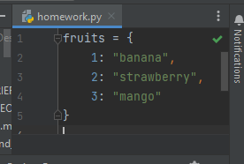
Answer 2 - what is a List Comprehension? : A list comprehension is a very simple tool for creating new lists on basis of existing ones. If we want to print some part of the list out or the whole of it, it can be used. It’s like a simpler way than using a for loop with if’s to iterate over a list in order to read through it and provide a specific result(s) or print all items. The last, 4th part, where the condition can be described, is optional.
Syntax for list comprehension is:
new_list = [do_what for list_item in iterable_list if condition == True]
List comprehension can actually be used for all 4 iterable collections in Python.
EXAMPLE List comprehension:
    fruits = ["banana", "strawberry", "mango", "grape"]
    new_list = [fruit for fruit in fruits if "g" in fruit]
    print(new_list)
^ This list comprehension will make a new list containing fruits list items which have the letter “g” in them.
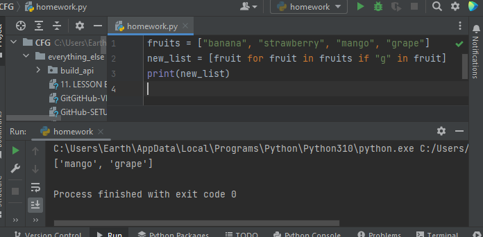
Sources: https://www.w3schools.com/python/python_dictionaries.asp https://www.w3schools.com/python/python_lists_comprehension.asp 

19. What is namespace in Python?
Answer: It’s like a phone book or a dictionary of the names used in both Python globally (as a language) and locally (in our instance of Python program, names we gave to objects in our program). It ensures uniqueness of object names in Python, which is actually a pretty great idea. There’s the list of in-built names and global names used by the Python language to function, akin to reserved keywords in Java. The dictionaries of namespaces can be accessed using the global() and local() methods and printed out to get a full list of currently used names of objects and objects.
Pretty neat, I wasn’t aware of this feature!
Sources: https://www.pythonforbeginners.com/basics/what-is-namespace-in-python ; https://www.javatpoint.com/namespace-in-python

20. What is pass in Python?
Answer: The word “Pass” in Python is used as a “skipping” word or a “filler” word, meaning the contents will be added at a later point in time, not now, but we still want to not get any “function/definition empty” error.
Sources: https://www.w3schools.com/python/ref_keyword_pass.asp ; https://www.geeksforgeeks.org/python-pass-statement

21. What is unit test in Python? 
Answer: “Unit Testing is the first level of software testing where the smallest testable parts of a software are tested. This is used to validate that each unit of the software performs as designed.”
“Unit testing makes code more foul-proof since you anticipate the cases where your code could potentially fail or produce a bug. Though you cannot predict all of the cases, you still address most of them.
A unit could be bucketed into various categories:
    • An entire module,
    • An individual function,
    • A complete interface like a class or a method.”
In Python, one can perform unit tests with aid of the module called unittest which was inspired by JUnit.
Sources: https://www.datacamp.com/tutorial/unit-testing-python ; https://www.geeksforgeeks.org/unit-testing-python-unittest ; https://docs.python.org/3/library/unittest.html ; https://www.javatpoint.com/python-unit-testing 

22. In Python what is slicing?
Answer: Slicing in Python is cutting out a slice, a piece of either a string or an object with an index such as a tuple or a list. It creates another object using the original object as base – cuts out a piece of the original object and saves it/ creates it to a new object. Using the indexing function we count list objects or string characters either from the left, so from the beginning of the iterable object (so starting from index zero) or from the right, from the end of it.. We can cut the object however we like using index values to indicate the cut (slice) start and end.
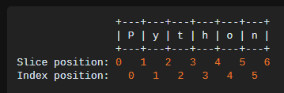
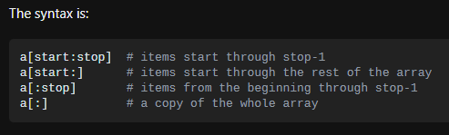
Sources: https://www.blog.duomly.com/slicing-in-python-what-is-it ; https://stackoverflow.com/questions/509211/understanding-slicing ; https://www.pythontutorial.net/advanced-python/python-slicing ; https://www.w3schools.com/python/ref_func_slice.asp 

23.  What is a negative index in Python?
Answer: As very briefly mentioned above, the negative index starts counting from the right side, so from the end of an object with an index, such as a strong or an indexable collection like a tuple or a list. Since there is no such a thing as a “negative zero”, -0, indexing from the right side starts with -1 value – the very last item from the left, when indexed from the right, so when it becomes the first indexed item from the right side, has an index of -1, not of 0.
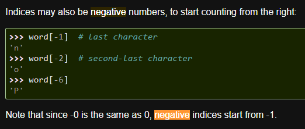
Sources: https://docs.python.org/3/tutorial/introduction.html#strings 

24.  How can the ternary operators be used in python? Give an example.
Answer: A ternary operator is basically simplified if-else construction, so a conditional expression, just written in 1 line of code. It can be used for example to iterate over lists or to apply a condition onto a collection to fish out only the items meeting our condition from the given list and returning them.
EXAMPLE:
    fruits = ["banana", "mango", "grape", "coconut"]
    print(fruits) if "strawberry" in fruits else fruits.append("strawberry")
    print(fruits)
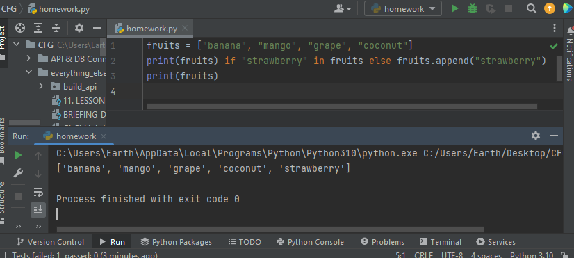
Sources: https://book.pythontips.com/en/latest/ternary_operators.html ; https://www.tutorialspoint.com/ternary-operator-in-python 

25. What does this mean: *args, **kwargs? And why would we use it?
Answer: These are wildcards when it comes to the number of arguments they represent. Instead of clearly defining how many arguments should our function take in, we use *args or *kwargs to say “this function should perform this action no matter how many arguments are provided – this number is yet unspecified and might vary”. The difference between *args and *kwargs is that the latter stands for arguments which we want keyworded (keyword arguments) – these will create a dictionary (a dicrionary pair will need to be provided for each **kwarg argument added, meaning two values will need to be provided, one for the dictionary key, one for the key value). **kwargs should be used whenever we require named arguments or a dictionary pair.
We would use *args and *kwargs whenever the number of arguments provided to the function to work on might vary in the future. Best example I saw was provided on freeCodeCamp.org. If we write a function to perform addition task:

And then we will want to sum up 3 numbers using it, we need to modify the function’s definition (because right now it takes in only 2 arguments):
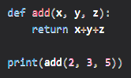
And if then we want to add only 2 numbers again, this function expecting 3 parameters will not perform its task if given only 2 parameters:
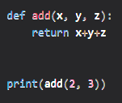
Result of a function expecting 3 parameters but only receiving 2 parameters:
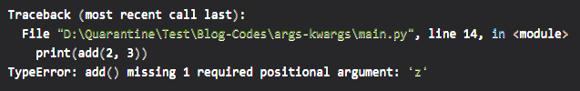
The function will produce an error due to the lack of the 3rd parameter (function expects 3 parameters, we only pass 2 parameters). We would need to modify this function again to make it work with 3 arguments again.
This is when using *args would be preferable, in order not to modify such a function each time a number of function parameters changes, but the core functionality of the function does not change. This allows 1 function to be able to operate with success on a varying number of arguments passed.
Sources: https://www.freecodecamp.org/news/args-and-kwargs-in-python https://book.pythontips.com/en/latest/args_and_kwargs.html 

26. How are range and xrange different from one another?
Answer: Depends which Python is used, 3.0 and up or 2.6 and below. In Python 2.6 and below there used to be a distinction between these two functions – range() returned a list (iterable object) and xrange() returned a generator object, it had to be iterated through to get workable integers from it (both range() and xrange() work with integer arguments exclusively). Function xrange() used less memory and thus was working faster. However, it was deprecated in Python 3.0:
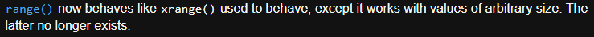
Sources: https://docs.python.org/3/whatsnew/3.0.html ; https://www.geeksforgeeks.org/range-vs-xrange-python ; https://www.javatpoint.com/range-vs-xrange-python 

27. What is Flask and what can we use it for?
Answer: Flask is a Python module (or: library) which facilitates development of websites and web applications. It is written in Python and made for Python. It’s a web framework, meaning it contains a lot of useful code (modules) for creating a web layer for the Python application, so a website / interface or a web app or an API. Flask with adds already coded functionalities which would facilitate connection management and contains web templates for the visual website interface (in Jinja engine). 
Sources: https://pythonbasics.org/what-is-flask-python ; https://www.geeksforgeeks.org/python-introduction-to-web-development-using-flask ; https://www.digitalocean.com/community/tutorials/how-to-make-a-web-application-using-flask-in-python-3 

28. What are clustered and non-clustered index in a relational database?
Answer: The key differences between these two indexes are:
    • Clustered index sorts the rows of the table, non-clustered does not
    • Clustered index relies on a primary key (non-repeatable, unique key)
    • In 1 table, there can be only 1 clustered index (because 1 set of data (table) can be only sorted in 1 way at a time – because sorting all the rows in the table according to 1 unrepeatable key affects all the rows)
    • 1 table can have 1 or more non-clustered indexes
    • Non-clustered index stores the information about the location of the data  (using a certain indexing key to refer to the data by) separately from the table, not inside the table
    • Clustered index is called “clustered” because it uses one or more columns to index (can use more than 1 column to index)
    • Clustered index stores key + data together
    • Clustered is called “primary” and non-clustered a “secondary” index
Sources:
https://docs.microsoft.com/en-us/sql/relational-databases/indexes/clustered-and-nonclustered-indexes-described?view=sql-server-ver16 ;
https://www.ibm.com/docs/en/ias?topic=indexes-clustered-non-clustered ; https://www.javatpoint.com/mysql-clustered-vs-non-clustered-index ; https://www.guru99.com/clustered-vs-non-clustered-index.html ; https://www.geeksforgeeks.org/difference-between-clustered-and-non-clustered-index

29. What is a ‘deadlock’ in a relational database?
Answer: “In a database, a deadlock is an unwanted situation in which two or more transactions are waiting indefinitely for one another to give up locks. Deadlock is said to be one of the most feared complications in DBMS as it brings the whole system to a Halt.”
My own words attempt: it’s a pat type situation where two (or more) operations collide with each other – they have locked (reserved for use – access, read & write) some resources (i.e. some table or db access) but cannot complete their action because some other resource necessary to complete their action is locked (by another operation, which also cannot be completed due to some resources it requires being locked) – and because they are cross locked, they will keep waiting forever, unless this standstill is detected and one of the operations aborted, to let one of them finish, and then perform the aborted one (or fix the issue which caused the deadlock and then perform the aborted operation).
“Necessary Conditions for Deadlock:
To successfully characterize a scenario as deadlock, the following four conditions must hold simultaneously:
    • Mutual Exclusion: At least one resource needs to be held by a process in a non-sharable mode. Any other process requesting that resource needs to wait.
    • Hold and Wait: A process must hold one resource and requests additional resources that are currently held by other processes.
    • No Preemption: A resource can’t be forcefully released from a process. A process can only release a resource voluntarily once it deems to release.
    • Circular Wait: A set of a process {p0, p1, p2,.., pn} exists in a manner that p0 is waiting for a resource held by p1, pn-1 waiting for a resource held by p0.
Sources: https://docs.oracle.com/javadb/10.6.2.1/devguide/cdevconcepts28436.html ; https://www.geeksforgeeks.org/deadlock-in-dbms ; https://www.baeldung.com/cs/deadlock-livelock-starvation 

30. What is a ‘livelock’ a relational database? 
Answer: “In the case of a livelock, the states of the processes involved in a live lock scenario constantly change. On the other hand, the processes still depend on each other and can never finish their tasks. […] In a deadlock, processes involved in a deadlock are stuck indefinitely and do not make any state change. However, in a live lock scenario, processes block each other and wait indefinitely but they change their resource state continuously. The notable point is that the resource state change has no effect and does not help the processes make any progress in their task.”
My own words attempt: A live lock is when the processes collide with each other in the way that they keep accessing and changing the same resources and due to codependency (and possibly also the constant overwriting) they can never complete their work.
“A real-world example of livelock occurs when two people make a telephone call to each other and both find the line is busy.”
Sources: https://www.baeldung.com/cs/deadlock-livelock-starvation ; https://www.guru99.com/what-is-livelock-example.html 

# 2. Python String Methods
(Kindly please see the theory_questions.py file for working code answers - uncomment to run and see the result)

| Method       | Description                                                                                                                                                                  | Example                                                                                                             |
|--------------|------------------------------------------------------------------------------------------------------------------------------------------------------------------------------|---------------------------------------------------------------------------------------------------------------------|
| capitalize() | Returns a string with its first character capitalized and the rest lowercase                                                                                                 | txt = "banana" print(txt.capitalize()) Result: Banana                                                               |
| casefold()   | Returns a string with all characters lowercase                                                                                                                               | txt = "BaNaNa" print(txt.casefold())  Result: banana                                                                |
| center()     | Centers string at specified length, and adds specified character as padding (default character == space)                                                                     | txt = "banana" print(txt.center(14, "-")) Result: ----banana----                                                    |
| count()      | Returns the number of times the specified value appears in the string                                                                                                        | txt = "Banana in bananas with banana" txt.count("banana")  Result: 2                                                |
| endswith()   | Returns true if the string ends with the specified value                                                                                                                     | txt = "banana?" print(txt.endswith("?"))  Result: True                                                              |
| find()       | Searches the string for a specified value and returns the first position of where it was found. If value wasn’t found returns -1.                                            | txt = "banana" print(txt.find("n"))  Result: 2                                                                      |
| format()     | Formats specified values in a string                                                                                                                                         | txt = "I got {amt} bananas" print(txt.format(amt=5)) Result: "I got 5 bananas"                                      |
| index()      | Searches the string for a specified value and returns the position of where it was found. If value wasn’t found,  method raises an exception                                 | txt = "banana" print(txt.find("a"))  Result: 1                                                                      |
| isalnum()    | Returns True if all characters in the string are alphanumeric                                                                                                                | txt = "banana20" print(txt.isalnum())  Result: True                                                                 |
| isalpha()    | Returns True if all characters in the string are in the alphabet                                                                                                             | txt = "banana20" print(txt.isalpha())  Result: False                                                                |
| isdigit()    | Returns True if all characters in the string are digits                                                                                                                      | txt = "520" print(txt.isdigit())  Result: True                                                                      |
| islower()    | Returns True if all characters in the string are lower case                                                                                                                  | txt = "banana" print(txt.islower())  Result: True                                                                   |
| isnumeric()  | Returns True if all characters in the string are numeric                                                                                                                     | txt = "520" print(txt.isnumeric()) Result: True                                                                     |
| isspace()    | Returns True if all characters in the string are whitespaces                                                                                                                 | txt = "          " print(txt.isspace())  Result: True                                                               |
| istitle()    | Returns True if the string follows the rules of a title                                                                                                                      | txt = "I Got 5 Bananas" print(txt.istitle())  Result: True                                                          |
| isupper()    | Returns True if all characters in the string are upper case                                                                                                                  | txt = "BANANA" print(txt.isupper())  Result: True                                                                   |
| join()       | Converts the elements of an iterable into a string                                                                                                                           | txt = "I", "got", "5", "bananas" print(" ".join(txt))  Result: I got 5 bananas                                      |
| lower()      | Converts a string into lower case                                                                                                                                            | txt = "BANANA" print(txt.lower())  Result: banana                                                                   |
| lstrip()     | Returns a left trim version of the string                                                                                                                                    | txt = "     banana     " print(txt.lstrip())  Result: "banana     "                                                 |
| replace()    | Returns a string where a specified value is replaced with a specified value                                                                                                  | txt = "I got 5 bananas" print(txt.replace("bananas", "coconuts"))  Result: I got 5 coconuts                         |
| rsplit()     | Splits the string at the specified separator, starting from the right, and returns a list. If no “maxsplit” parameter is specified, the result will be the same as “split()” | txt = "banana, coconut, pineapple" print(txt.rsplit(", ", 1)) Result: ['banana, coconut', 'pineapple']              |
| rstrip()     | Returns a right trim version of the string                                                                                                                                   | txt = "     banana     " print(txt.rstrip())  Result: "     banana"                                                 |
| split()      | Splits the string at the specified separator, starting from the left, and returns a list.                                                                                    | txt = "banana, coconut, pineapple" print(txt.split(", ", 1))  Result: ['banana', 'coconut, pineapple']              |
| splitlines() | Splits the string at the line break and returns a list.                                                                                                                      | txt = "I got 5 bananas\nHe got 2 bananas" print(txt.splitlines())  Result: ["I got 5 coconuts", "He got 2 bananas"] |
| startswith() | Returns true if the string starts with the specified value                                                                                                                   | txt = "Bananas? I got 5" print(txt.startswith("Bananas"))  Result: True                                             |
| strip()      | Remove spaces at the beginning and at the end of the string and returns a trimmed string                                                                                     | txt = "   Bananas   " print(txt.strip())  Result: "Bananas"                                                         |
| swapcase()   | Swaps cases, lower case becomes upper case and vice versa                                                                                                                    | txt = "BaNaNaS" print(txt.swapcase())  Result: "bAnAnAs"                                                            |
| title()      | Converts the first character of each word to upper case                                                                                                                      | txt = "I got 5 bananas" print(txt.title())  Result: "I Got 5 Bananas"                                               |
| upper()      | Converts a string into upper case                                                                                                                                            | txt = "banana" print(txt.upper())  Result: BANANA                                                                   |

# 3. Python List Methods

(Kindly please see the theory_questions.py file for working code answers - uncomment to run and see the result)

| Method    | Description                                                                           | Example                                                                                                                                                  |
|-----------|---------------------------------------------------------------------------------------|----------------------------------------------------------------------------------------------------------------------------------------------------------|
| append()  | Adds an element at the end of the list                                                | list = ["banana", "coconut"] list.append("pineapple") print(list)  Result: ['banana', 'coconut', 'pineapple']                                            |
| clear()   | Removes all the elements from the list                                                | list = ["banana", "coconut"] list.clear() print(list)  Result: list == []                                                                                |
| copy()    | Returns a copy of the list                                                            | list = ["banana", "coconut"] list2 = list.copy() print(list2)  Result: list2 == ['banana', 'coconut']                                                    |
| count()   | Returns the number of elements with the specified value                               | list = ["banana", "coconut", "banana"] print(list.count("banana"))  Result: 2                                                                            |
| extend()  | Add the elements of a list (or any iterable), to the end of the current list          | list = ["banana", "coconut"] list2 = ["pineapple", "mango"] list.extend(list2) print(list)  Result: list == ['banana', 'coconut', 'pineapple', 'mango']  |
| index()   | Returns the index of the first element with the specified value                       | list = ["banana", "coconut"] print(list.index("coconut"))  Result: 1                                                                                     |
| insert()  | Adds an element at the specified position                                             | list = ["banana", "coconut"] list.insert(1, "mango") print(list)  Result: ['banana', 'mango', 'coconut']                                                 |
| pop()     | Removes the element at the specified position from the list, and returns removed item | list = ["banana", "coconut"] print(list.pop(1))  Result: "coconut"                                                                                       |
| remove()  | Removes the first item with the specified value                                       | list = ["banana", "coconut"] list.remove("coconut") print(list)  Result: list == ['banana']                                                              |
| reverse() | Reverses the order of the list                                                        | list = ["banana", "coconut", "pineapple", "mango"] list.reverse() print(list)  Result list == ['mango', 'pineapple', 'coconut', 'banana']                |
| sort()    | Sorts the list                                                                        | list = ["pineapple", "banana", "mango", "coconut"] list.sort() print(list)  Result: list == ['banana', 'coconut', 'mango', 'pineapple']                  |

# 4. Python Tuple Methods

(Kindly please see the theory_questions.py file for working code answers - uncomment to run and see the result)

| Method  | Description                                                                                   | Example                                                                         |
|---------|-----------------------------------------------------------------------------------------------|---------------------------------------------------------------------------------|
| count() | Returns the number of times a specified value occurs in a tuple                               | thistuple = (1, 3, 7, 8, 7, 5, 4, 6, 8, 5) print(thistuple.count(5))  Result: 2 |
| index() | Searches the tuple for a specified value and returns the first position of where it was found | thistuple = (1, 3, 7, 8, 7, 5, 4, 6, 8, 5) print(thistuple.index(8))  Result: 3 |

# 5. Python Dictionary Methods

(Kindly please see the theory_questions.py file for working code answers - uncomment to run and see the result)

| Method                   | Description                                                                                                  | Example                                                                                                                                        |
|--------------------------|--------------------------------------------------------------------------------------------------------------|------------------------------------------------------------------------------------------------------------------------------------------------|
| clear()                  | Removes all the elements from the dictionary                                                                 | pet = {"type": "cat", "name": "Fluff"} pet.clear() print(pet)  Result: pet == {}                                                               |
| copy()                   | Returns a copy of the dictionary                                                                             | pet = {"type": "cat", "name": "Fluff"} pet2 = pet.copy() print(pet2)  Result: pet2 == {'type': 'cat', 'name': 'Fluff'}                         |
| fromkeys()               | Returns a dictionary with the specified keys and optional value (default is None)                            | keys = ("type", "name") print(dict.fromkeys(keys, "X"))  Result: {'type': 'X', 'name': 'X'}                                                    |
| get()                    | Returns the value of the specified key                                                                       | pet = {"type": "cat", "name": "Fluff"} print(pet.get("name"))  Result: "Fluff"                                                                 |
| items()                  | Returns a list containing a tuple for each key value pair                                                    | pet = {"type": "cat", "name": "Fluff"} print(pet.items())  Result: dict_items([('type', 'cat'), ('name', 'Fluff')])                            |
| keys()                   | Returns a list containing the dictionary's keys                                                              | pet = {"type": "cat", "name": "Fluff"} print(pet.keys())  Result: dict_keys(['type', 'name'])                                                  |
| pop()                    | Removes the element with the specified key and returns this item                                             | pet = {"type": "cat", "name": "Fluff"} print(pet.pop("type"))  Result: “cat”                                                                   |
| popitems() [ popitem() ] | Removes the last inserted key-value pair and returns it                                                      | pet = {"type": "cat", "name": "Fluff"} print(pet.popitem())  Result: ('name', 'Fluff')+ the dictionary is only {"type": "cat"}                |
| setdefault()             | Returns the value of the specified key. If the key does not exist: inserts the key with the specified value. | pet = {"type": "cat", "name": "Fluff"} pet.setdefault("color", "white") print(pet)  Result: {'type': 'cat', 'name': 'Fluff', 'color': 'white'} |
| update()                 | Updates the dictionary with the specified key-value pairs                                                    | pet = {"type": "cat", "name": "Fluff"} pet.update({"color": "white"}) print(pet)  Result: {'type': 'cat', 'name': 'Fluff', 'color': 'white'}   |
| values()                 | Returns a list of all the values in the dictionary                                                           | pet = {"type": "cat", "name": "Fluff", "color": "white"} print(pet.values())  Result: dict_values(['cat', 'Fluff', 'white'])                   |

# 6. Python Set Methods

(Kindly please see the theory_questions.py file for working code answers - uncomment to run and see the result)

| Method                 | Description                                                                                                        | Example                                                                                                                                               |
|------------------------|--------------------------------------------------------------------------------------------------------------------|-------------------------------------------------------------------------------------------------------------------------------------------------------|
| add()                  | Adds an element to the set                                                                                         | set = {"banana", "coconut"} set.add("pineapple") print(set)  Result: {'pineapple', 'coconut', 'banana'}                                               |
| clear()                | Removes all the elements from the set                                                                              | set = {"banana", "coconut"} set.clear() print(set)  Result: set()                                                                                     |
| copy()                 | Returns a copy of the set                                                                                          | set = {"banana", "coconut"} set2 = set.copy() print(set2)  Result: {'coconut', 'banana'}                                                              |
| difference()           | Returns a set containing the difference between two or more sets                                                   | set = {"banana", "coconut", "mango"} set2 = {"coconut", "pineapple"} print(set.difference(set2))  Result: {'mango', 'banana'}                         |
| intersection()         | Returns a set containing matching elements of two or more sets                                                     | set = {"banana", "coconut", "mango"} set2 = {"coconut", "pineapple"} print(set.intersection(set2))  Result: {'coconut'}                               |
| issubset()             | Returns a boolean (T/F) whether another set contains this set or not                                               | set = {"coconut", "pineapple"} set2 = {"banana", "coconut", "mango", "pineapple"} print(set.issubset(set2))  Result: True                             |
| issuperset()           | Returns a boolean (T/F) whether this set contains another set or not                                               | set = {"banana", "coconut", "mango", "pineapple"} set2 = {"banana", "coconut"} print(set.issuperset(set2))  Result: True                              |
| pop()                  | Removes a random element from the set and returns it                                                               | set = {"banana", "coconut", "mango"} print(set.pop())  Result: each time different 1 random item of the 3 elements in my set                          |
| remove()               | Removes the specified element from the set                                                                         | set = {"banana", "coconut", "mango"} set.remove("banana") print(set)  Result: {'coconut', 'mango'}                                                    |
| symmetric_difference() | Returns a set with the differences of two sets, so a set containing all items from both sets except the duplicates | set = {"banana", "coconut", "mango"} set2 = {"coconut", "pineapple"} print(set.symmetric_difference(set2))  Result: {'pineapple', 'banana', 'mango'}  |
| union()                | Returns a set containing all unique items from both sets (duplicates will only appear once)                        | set = {"banana", "coconut", "mango"} set2 = {"coconut", "pineapple"} print(set.union(set2))  Result: {'banana', 'mango', 'coconut', 'pineapple'}      |
| update()               | Updates a set with values from a set or an iterable                                                                | set = {"banana", "coconut", "mango"} set2 = {"coconut", "pineapple"} set.update(set2) print(set)  Result: {'banana', 'mango', 'pineapple', 'coconut'} |

# 7. Python File Methods

(Kindly please see the theory_questions.py file for working code answers - uncomment to run and see the result)

| Method       | Description                                                                                                                                                                                                                                                   | Example                                                                                                                                                                      |
|--------------|---------------------------------------------------------------------------------------------------------------------------------------------------------------------------------------------------------------------------------------------------------------|------------------------------------------------------------------------------------------------------------------------------------------------------------------------------|
| read()       | Returns the specified number of bytes from the file - if no argument provided, reads the whole file.                                                                                                                                                          | with open("banana.txt", "r") as f:     print(f.read())  Result: the whole content of banana.txt file                                                                         |
| readline()   | Returns one line from the file                                                                                                                                                                                                                                | with open("banana.txt", "r") as f:     print(f.readline())  Result: the first line of banana.txt file                                                                        |
| readlines()  | Returns a list containing each line in the file as a list item                                                                                                                                                                                                | with open("banana.txt", "r") as f:     print(f.readlines())  Result: a list of lines of banana.txt file                                                                      |
| write()      | Writes the specified string to the file. Where the text will be inserted depends on the file mode and stream position: "a" : appends - the text will be inserted at the end of the file "w" : the file will be emptied before the text insertion - overwrites | with open("banana.txt", "a") as f:     f.write("Bananas were here!") Result: "Bananas were here!" was added at the end of the banana.txt file                                |
| writelines() | Writes a list of strings to the file. Text location is decided the same way as with the write() method.                                                                                                                                                       | f = open("banana.txt", "a") f.writelines(["Bananas were here!", "And they will come back!"]) f.close()  Result: Two lines as will be added at the end of the banana.txt file |

