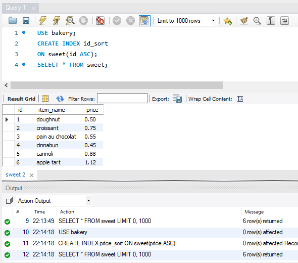
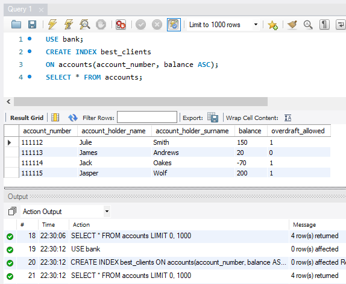
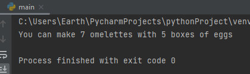

#HOMEWORK WEEK 2
#####(handout for students)
## TASK 1 (SQL)
#### MySQL Index:
NOTE: this is a very common question in tech interviews. The most important index types we need to know about are:
- Single column and multi-column index
- Composite index
- Clustered index

#### Questions 1-4: Write definitions for each types and provide an example (you can find examples online, but you need to write them down for each type).

#### Answer1: INDEX – Definition:
An additional structure of data in the database sorted by the indexing column which allows for faster searching via faster excluding results that do not meet the search criteria. It does not sort the data in the table, just adds the information about the location of each row/value as per the indexing column. Pretty much like in a phone book, if the index is A-Z by the “surname”, if we want to find a phone number of someone named “Smith” we don’t read the whole phone book but start with the letter “S”, so exclude all entries A-(whatever letter is right before S starts) and look for that surname where S surnames start. Databases are usually nor ordered, but indexes contain the information about some data (we can choose the “surname” data column, or a part of it – maybe just first 5 letters or something) – the information where this data is located in the data set (column). Without indexing the search query would need to read the entire database, and with indexing it can refer to the index and use the information where the data corresponding to our search query limitation is located in the data set (column).

#### Answer2: INDEX – Single column & multi-column index:
Single column index refers to only 1 column from the whole database (and stores the information about the location of the data in that column) , for example “surname”, while multi-column (up to 16 columns I read) references more than 1 column, for example “surname” and “first_name” – then both of these values can be searched in a faster way via indexing (without the need to read through the entire DB to return the search query result).

Single column index example (using “user_surname” as the indexing column):

    TABLE:
    user_id ; user_name ; user_surname
    1 ; anna ; lewandowska
    2 ; izabela ; czernia
    3 ; wojciech ; rubino
    
    INDEX:
    lewandowska -> 1
    czernia -> 2
    rubino -> 3

(where the 1, 2, 3 means the row/position in the table, not the value from user_id column, but since this table is sorted by user_id, it’s in this case synonymous)

Multi-column index example (using “user_surname” and “user_name” as indexing columns):

    TABLE:
    user_id ; user_name ; user_surname
    1 ; anna ; lewandowska
    2 ; izabela ; czernia
    3 ; wojciech ; rubino
    
    INDEX:
    lewandowskaanna -> 1
    czerniaizabela -> 2
    rubinowojciech -> 3
    
(where the 1, 2, 3 means the row/position in the table, not the value from user_id column, but since this table is sorted by user_id, it’s in this case synonymous)

#### Answer3: INDEX – Composite index:
Same thing as the multi-column index, just named differently. Data from 2-16 columns are put together to make up 1 indexing value to which a location is ascribed to enable faster searching. “A multiple-column index can be considered a sorted array, the rows of which contain values that are created by concatenating the values of the indexed columns.”

Composite index example (using “user_surname” and “user_name” as indexing columns):

    TABLE:
    user_id ; user_name ; user_surname
    1 ; anna ; lewandowska
    2 ; izabela ; czernia
    3 ; wojciech ; rubino
    
    INDEX:
    lewandowskaanna -> 1
    czerniaizabela -> 2
    rubinowojciech -> 3
    
(where the 1, 2, 3 means the row/position in the table, not the value from user_id column, but since this table is sorted by user_id, it’s in this case synonymous)

Sources for above 3 questions’ answers:
https://www.oreilly.com/library/view/high-performance-mysql/0596003064/ch04.html
https://user3141592.medium.com/single-vs-composite-indexes-in-relational-databases-58d0eb045cbe
https://dev.mysql.com/doc/refman/8.0/en/multiple-column-indexes.html
https://stackoverflow.com/questions/795031/how-do-composite-indexes-work

#### Answer 4: INDEX – Cluster index:
From what I’ve understood, a clustered index differs from the non-clustered ones by that it actually sorts the actual table itself, while a non-clustered index does not sort the rows of data in the actual table, just stores the information about the location of the data (using a certain indexing key to refer to the data by) separately from the table, not in the table, and does not alter/sort/arrange/organise the rows in the table, just operates on the extracted data, externally.
So a clustered index actually does sort/organise the data rows in the table.
Its vital properties are: 1 table can be sorted (ordered) using a clustered index only in 1 way – as in, sorting by 1 column of data will affect all the other columns belonging to the row as well. Any table can be only sorted by using 1 index at a time. This index can be made up of more than 1 column of data though, but it’s still tantamount to 1 way of sorting (1 sorting key).
“The only time the data rows in a table are stored in sorted order is when the table contains a clustered index.”
Primary Key is a good example.

Clustered index example (using “user_id” and “user_surname” as the indexing columns):

    TABLE:
    user_id ; user_name ; user_surname
    1 ; anna ; lewandowska
    2 ; izabela ; czernia
    3 ; wojciech ; rubino
    
    INDEX:
    1lewandowska -> 1
    2czernia -> 2
    3rubino -> 3

(where the 1, 2, 3 on the left is the “user_id” indexing column and the 1, 2, 3 on the right is the assigned order/indexed position – in here we order & sort the table by the primary key “user_id” and thus each table row has the same order as the number values in “user_id”) 

Source for the above question #4:
https://docs.microsoft.com/en-us/sql/relational-databases/indexes/clustered-and-nonclustered-indexes-described?view=sql-server-ver16
https://www.ibm.com/docs/en/ias?topic=indexes-clustered-non-clustered

#### Task 1 Question 2
Add a new index to the ‘Sweet’ table in Bakery database (any column - explain your choice)

    USE bakery;
    CREATE INDEX id_sort
    ON sweet(id ASC);

Explanation: ID is a unique value which’s main purpose is for item identification and sorting. ID is usually the primary key as well precisely because of this, and primary key is a great index, for the same reasons.

#### Task 1 Question 3:
Add a new index (multi-column) to the table ‘Accounts’ in the Bank database (explain your choice of columns). 

    USE bank;
    CREATE INDEX best_clients
    ON accounts(account_number, balance ASC);

Explanation: I chose account number and its balance because I think bank might be more interested in who of their clients is overdraft and should be contacted and who of their clients keeps a lot of money in their accounts and might be contacted with additional offers. The name of this index is arbitrary and my idea might not be the best.

## TASK 2 (SQL)

    • Study the extra curriculum topics about Triggers and Events (sql_session6 slide deck marked HOMEWORK SLIDES)

    • Review and run exercises provided to understand how Triggers and Events work (use scripts in your handouts example_event.sql and example_trigger.sql)

(you do not need to submit anything for this task, but you may come across these topics in the future assessments and interviews)

Thank you for the advice 😊 Noted. I reviewed all the material twice anyway 😊

## TASK 3 (Python)

#### Task 3 Question 1
I am building some very high-quality chairs and need exactly four nails for each chair. I've written a program to calculate how many nails I need to buy to build these chairs.

    chairs = '15'
    nails = 4
    total_nails = chairs * nails
    message = 'I need to buy {} nails'.format(total_nails)
    print(message)
    
When I run the program, it tells me that I need to buy 15151515 nails. This seems like a lot of nails.
Is my program calculating the total number of nails correctly? What is the problem? How do I fix it? Write your explanation, along with the code to fix this, below.

#### Task 3 Answer 1
This is because the variable “chairs” is ascribed the value 15 in the apostrophes, resulting in the “total_nails” repeating the value 15 4 times, because it understands “chairs” value as a String value, hence it does not multiply the 15 like one would a number, giving a result of 60, but it repeats it 4 times – in Python one can “multiply” String values like this, not possible in Java, also you wouldn’t have this problem in Java because you need to declare variable types, so that error would be detected in Java – it would tell you that you cannot perform mathematical operations on words/Strings.
##### How to fix it?
The easiest way is to remove the apostrophes to remove the type ambiguity – both “nails” and “chairs” will be then interpreted as integer variables:/ chairs = 15 / works.

#### Task 3 Question 2
I'm trying to run this program, but I get an error. What is the error telling me is wrong? How do I fix the program?

    my_name = Penelope
    my_age = 29
    message = 'My name is {} and I am {} years old'.format(my_name, my_age)
    print(message)
    
#### Task 3 Answer 2
The variable “my_name” was ascribed a value in latin script letters, but the apostrophes are missing. When ascribing values to variables in Python, no apostrophes hint to Python that the value might be interpreted as a numeric type value, and apostrophes hint to Python that the value might be interpreted as a text (String) value type.
The reference “Penelope” causes an error because it is incorrect if to be interpreted as a numeric value (because it’s letters) and it is also incorrect if it is to be interpreted as a text (String) value because it lacks the necessary apostrophes.
##### How to fix it?
The easiest way is to add the missing apostrophes: / my_name = 'Penelope' / works.

#### Task 3 Question 3
I have a lot of boxes of eggs in my fridge and I want to calculate how many omelettes I can make. Write a program to calculate this.
Assume that a box of eggs contains six eggs and I need four eggs for each omelette, but I should be able to easily change these values if I want. The output should say something like:
"You can make 9 omelettes with 6 boxes of eggs"

#### Task 3 Answer 3
(Kindly please see the .py file with code attached. Result is as follows:)

#### Task 3 Question 4
Complete a series of tasks to format strings

#### Task 3 Question 4 Task 1
Replace the (.) character with (!) instead. Output should be “I love coding!”

    my_str = "I love coding."
    # Type your code here.
    print(my_str)
    
#### Task 3 Question 4 Task 1 - Answer: 

    my_str = "I love coding."
    my_str2 = my_str.replace('.', '!')
    print(my_str2)

#### Task 3 Question 4 Task 2
Reassign str so that all of its characters are lowercase.

    my_str_1 = "EVERY Exercise Brings Me Closer to Completing my GOALS."
    # Type your code here.
    print(my_str_1)
    
#### Task 3 Question 4 Task 2 - Answer:

    my_str_1 = "EVERY Exercise Brings Me Closer to Completing my GOALS."
    my_str_2 = my_str_1.lower()
    print(my_str_2)

#### Task 3 Question 4 Task 3
Output whether this string starts with an A or not

    my_str_2 = "We enjoy travelling"
    # Type your code here.
    ans_1 = 
    print(ans_1)

#### Task 3 Question 4 Task 3 - Answer:

    my_str_2 = "We enjoy travelling"
    ans_1 = my_str_2.startswith('A')
    print(ans_1)

#### Task 3 Question 4 Task 4
What is the length of the given string?

    my_str_3="1.458.001"
    # Type your code here:
    ans_2=
    print(ans_2)

#### Task 3 Question 4 Task 4 - Answer:

    my_str_3 = "1.458.001"
    ans_2 = len(my_str_3)
    print(ans_2)

#### Task 3 Question 5
Complete a series of tasks to slice strings
 
#### Task 3 Question 5 Task 1
Slice the word so that you get "thon".

    wrd="Python"
    # Type your answer here.
    ans_1=
    print(ans_1)
    
#### Task 3 Question 5 Task 1 - Answer:

    wrd = "Python"
    ans_1 = wrd[2:]
    print(ans_1)

#### Task 3 Question 5 Task 2
Slice the word until "o". (Pyth)

    wrd="Python"
    # Type your answer here.
    ans_1=
    print(ans_1)

#### Task 3 Question 5 Task 2 - Answer:

    wrd = "Python"
    ans_1 = wrd[:4]
    print(ans_1)

#### Task 3 Question 5 Task 3
Now try to get "th" only.

    wrd="Python"
    # Type your answer here.
    ans_1=
    print(ans_1)
    
#### Task 3 Question 5 Task 3 - Answer:

    wrd = "Python"
    ans_1 = wrd[2:4]
    print(ans_1)

#### Task 3 Question 5 Task 4
Now slice the word with steps of 2, excluding first and last characters

    wrd="Python"
    # Type your answer here.
    ans_1=
    print(ans_1)

#### Task 3 Question 5 Task 4 - Answer:

    wrd = "Python"
    ans_1 = wrd[1:5]
    print(ans_1)

#### Task 3 Question 6
Explain what this program does:

    for number in range(100):
    	output = 'o' * number
    	print(output)
    	
#### Task 3 Answer 6:
This program prints an o letter times a number. If a number is equal to 1, it prints out one letter o. If the number is equal to 53, it prints out 53 letters o. Unformatted, without any spacing or additions, in one straight line. Each line incremented by +1 o.
The number is defined as a range up to one hundred, so the program prints the letter o from 0 to 99 (first line is invisible because it is not possible to print zero o’s – zero o’s means no o printed, basically. Also multiplying times zero = zero anwyay).
The result then is an increasing (by 1 per row/line) number of letter o printed out – from zero letters to 99 letters. Yes, 99 letters is the last row, not 100 letters. Ranges are all -1 because first position = zero, so it’s not 1-100 but 0-99 when the range is up to 100. The 100th number is excluded from the range as it is the 101th position.

#### Task 3 Question 7
Your boss really likes calculating VAT on their purchases. It is their favourite hobby. They've written this code to calculate VAT and need your help to fix it.

    def calculate_vat(amount):
    	amount * 1.2
    total = calculate_vat(100)
    print(total)

When your boss runs the program they get the following output:

    None 

Your boss expects the program to output the value 120. What is wrong? How do you fix it?

#### Task 3 Answer 7
This code will not work properly because the function defined does not return any value – it is missing the word “return” in order to work. For styling, there also should be 2 empty lines between a function and the next line of code in Python. This works:

    def calculate_vat(amount):
        return amount * 1.2
    
    
    total = calculate_vat(100)
    print(total)

Note: without the tabulator this also doesn’t work. So this doesn’t work:

    def calculate_vat(amount):
    return amount * 1.2
    
    
    total = calculate_vat(100)
    print(total)

^ Without the tab it returns an error “IndentationError: expected an indented block after function definition on line 1”.

#### Task 3 Question 8
Write a new function to print a ‘cashier receipt’ output for a shop (any shop – clothes, food, events etc).
It should accept 3 items, then sum them up and print out a detailed receipt with TOTAL.
For example:
Input:
Item_1_name = ‘Trainers’
Item_1_price = 50.45
Item_2_name = ‘T-shirt
Item_2_price = 12
Output:
Trainers	50.45
T-shirt	12.00
TOTAL       	62.45

#### Task 3 Answer 8:

I wasn’t exactly sure what would be best to use here, thought about an array, but I’d need more time to implement the “if null then don’t print” logic and to format the output to print out as a table, not print out first the names in one row and then the prices in another row, which makes no sense here.

This solution is certainly not the best (without a sustainable data structure) but it does print out the desired output, and the changing of the values remains easy:

    item_1_name = 'Trainers'
    item_1_price = 50.45
    item_2_name = 'T-shirt'
    item_2_price = 12
    item_3_name = ''
    item_3_price = 0
    total = item_1_price + item_2_price + item_3_price
    
    print("{} {} \n{} {} \n{} {} \nTOTAL {}".format(item_1_name, item_1_price, item_2_name, item_2_price, item_3_name, item_3_price, total))
 
It’s a simple printout, but produces a better result than my experiments with arrays and for loops thus far.