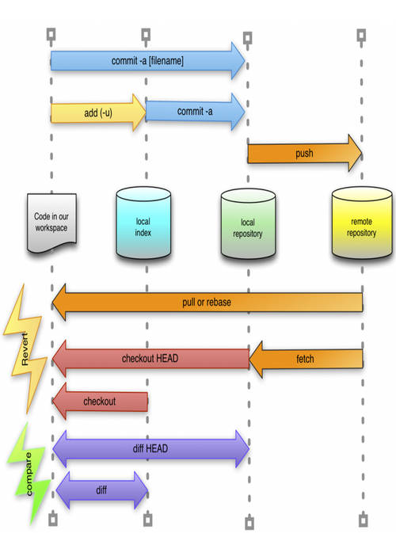
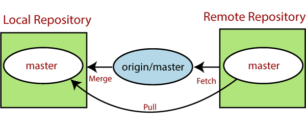

# HOMEWORK WEEK 4
##### (Handout for students)

## TASK 1 (Git and GitHub)

#### Task 1 Question 1
Complete definitions for key Git & GitHub terminology

##### GIT WORKFLOW FUNDAMENTALS
·        Working Directory
##### ANSWER:
A working directory is basically the main folder with our project files and subfolders. This is the folder we indicate with git init command and initialize into a GitHub repository (this adds the .git folder and GitHub tracking option). A directory means a folder, and a working directory is basically the folder with our whole project in it, which we make the GitHub repository of and continue to work on. Files in a working directory can be traced by GitHub or not (excluded with git ignore). 
Sources: https://medium.com/tech-journey-with-anna/git-question-what-is-the-difference-between-the-working-directory-aka-workspace-and-the-eeee15b7e4b3 ; https://stackoverflow.com/questions/36201342/git-where-exactly-is-the-working-directory 

·        Staging Area
##### ANSWER:
It’s like the preparation area in the kitchen. I want to cook Chinese stir fry – let’s for the sake of this analogy understand the wok as the commit – whatever lands in the wok is committed to the stir fry. So a staging area is my prep area, where I put out all the sauce bottles, soya, sesame and all the spices, all the vegetables, cut them and prepare them, and also thaw and cut the chicken. In the first commit, I’d want to commit the chicken and some oil only, then in the second commit I’d want to commit the vegetables, and in the 3rd one, the seasoning (sauces and all the spices). The staging area helps me prepare all these stuffs for a commit – I can have them all laid out and work on them in whatever order I want, and once ready, I can commit them. While reading this I also understood a bit more/better about the importance of segmentation for commits (i.e. making 1 commit for 1 function, clear update, with a  clear comment too), and this in turn actually answers my earlier question about the importance of staging. Staging tracks the changes made in the tracked files (not in the ignored ones) and when asked with git status the repo will answer what is staged, what is not added for staging so that we can see clearly the current status of our repository and the staging area. Files can be added or removed to/from the staging area.
Sources: https://coderefinery.github.io/git-intro/staging-area ; https://stackoverflow.com/questions/49228209/whats-the-use-of-the-staging-area-in-git ; https://dev.to/sublimegeek/git-staging-area-explained-like-im-five-1anh 

·        Local Repo (head)
##### ANSWER 1 – what is HEAD in GitHub?
HEAD refers to the current commit. Per default it refers to the most recent commit, tip of the master branch. HEAD can be also used to access (check out, view) specific commits from the repository’s commit history. 
stackoverflow.com/questions/2304087/what-is-head-in-git ; git-scm.com/book/en/v2/Git-Internals-Git-References  ; careerkarma.com/blog/what-is-a-git-head ; < Sources
##### ANSWER 2 - what is a Local Repository?

A local repository is a GitHub repository (meaning: a folder on our computer or local network to which we have direct access which was initialized with git init into a GitHub repository and thus contains the .git folder) which is located in our local network, usually on our computer. It is a repository into which we commit our changes before pushing them to the remote repository, and to which we fetch from the remote repository.

·        Remote repo (master)
##### ANSWER 1 – What is “master” in GitHub?
A “master” is the indication of the default and main branch in GitHub – when working with branches, for example developing frontend separately from backend or having more than 1 developer working on some features concurrently, it is best and advisable to split the project into branches, so that each of these developers can work on the project on their own branch, committing to the repository using their branch without affecting other people working on other branches. When their part of the code was finished and tested, it can be merged with the main branch (master branch) where the main code is, and the side branch they used to work on can then be erased (as it won’t be needed anymore, served its purpose, the code is now merged with the main branch code). We use branches to work on in order to prevent several developers constantly overwriting the same files with different changes, overwriting someone else’s changes in the process – that would happen if several people were all working on the same 1 branch, the main branch. Each branch, both the side branches and the main branch, of course have their own history of commits, just when the side branch is merged with the main branch, the history also merges.
There is no practical difference between “main” and “master” – it’s just the nomenclature, both describe the same thing – the default, main branch of the repository. GitHub changed “master” to “main” on GitHub in 2020 after BLM happened to get rid of any and all connotations the word “master” might have with slavery. Hard drives used to be master and slave since they existed, and I always just saw it as a very succinct description of their setup/function. It’s still possible to use both of these names and you can change this setup in GitHub. 
Only worth highlighting, if we set our project’s default branch to be “main” instead of “master”, then we should use this name in the commands like git push origin main instead of git push origin master – if we set the main branch’s name to be “main” and then run the git push origin master command, GitHub will create the master branch and push our commit to that location, we will end up having two branches, main and master. So it’s best to pick one version and stick to it to avoid confusion.
Sources: stackoverflow.com/questions/64249491/why-does-git-push-main-work-on-github-when-git-push-master-does-not-also-wh ; github.blog/changelog/2020-10-01-the-default-branch-for-newly-created-repositories-is-now-main ; https://github.com/github/renaming ; https://www.zdnet.com/article/github-to-replace-master-with-main-starting-next-month
##### ANSWER 2 – What is a remote repository in GitHub?
A remote repository is a repository (folder with files, essentially, which contains the .git folder and is tracked by the GitHub version control) which is stored remotely, so not locally, but in some remote location outside of our local network, not on our computer. “Remote repositories are versions of your project that are hosted on the Internet or network somewhere. You can have several of them, each of which generally is either read-only or read/write for you. Collaborating with others involves managing these remote repositories and pushing and pulling data to and from them when you need to share work.”.
Sources: https://git-scm.com/book/en/v2/Git-Basics-Working-with-Remotes ; https://docs.github.com/en/get-started/getting-started-with-git/about-remote-repositories ; https://docs.github.com/en/get-started/getting-started-with-git/managing-remote-repositories 

##### WORKING DIRECTORY STATES:
·        Staged
##### ANSWER:
A staged file is a GitHub tracked file which was modified somehow (either a new file or an updated file, or a deleted file actually too – can be erased locally and staged for deleting also in the remote repository – syncing the change of deleting that file) AND which is prepared for being committed – added to the staging area. We stage files for committing by adding them using git add command – in this way, we can choose which of the modified files we wish to include in the nearest commit and which should not be included. Files which are staged can be then committed (or removed from the staging area by git reset).
Sources: https://github.com/git-guides/git-add ; https://www.geeksforgeeks.org/states-of-a-file-in-git-working-directory ; https://docs.gitlab.com/ee/topics/git/unstage.html

·        Modified
##### ANSWER:
A modified GitHub tracked file is a file which has underwent any change in content or status since the last commit to the repository – can be an updated content (expanded or detracted), can be renamed, can be a completely new file spawned into existence, can be a deletion of a file – all of these are modifications. Command git status will list the current status of our repository, complete with a list of modified files and their statuses (if they’re staged or not). 
Source: https://git-scm.com/book/en/v2/Git-Basics-Recording-Changes-to-the-Repository 

·        Committed
##### ANSWER:
Committed state file means that the previously staged changes/updates to the files in the repository were applied to the repository – updated accordingly and saved in the repository. The commit is now in repository’s version history, can be viewed and retracted. When committing an update, it is a best practice to group it with some logic (i.e. 1 function update, 1 function added/removed) and a clear description of what this commit adds/changes/removes (does, basically) – otherwise it can be hard to track the version history of our modifications, in time even we, the author, may forget what we’ve done if all our updates are named ambiguously like “adding the files I forgot to add before”.
Sources: https://coderefinery.github.io/git-intro/staging-area  ;  https://git-scm.com/book/en/v2/Git-Basics-Recording-Changes-to-the-Repository ; https://www.geeksforgeeks.org/states-of-a-file-in-git-working-directory 

##### GIT COMMANDS:
·        Git add

##### ANSWER:
The command git add adds a file or many files to the staging area of the GitHub repository. We can check which files were added to the staging area using the command git status. We can add files to the staging area as well as remove them in order to craft the future commit up to our liking.
Source: https://github.com/git-guides/git-add

·        Git commit
##### ANSWER:
The command git commit commits the files from the staging area of the GitHub repository (previously added to the staging area of the GitHub repo) to the GitHub repository. This means the updates are now “saved” and the commit is added to the history of our project’s versions. It is possible to add a comment to the commit using the addition of –m “your comment goes here”. It is well worth to make clear commit descriptions for future reviews. The commits are committed to our local repository (we are working on the local branch of our repository – never on the remote one, that’s neither possible nor advisable).
Sources: https://coderefinery.github.io/git-intro/staging-area  ;  https://git-scm.com/book/en/v2/Git-Basics-Recording-Changes-to-the-Repository ; https://www.geeksforgeeks.org/states-of-a-file-in-git-working-directory 

·        Git push
##### ANSWER:
The command git push forwards/updates the commits committed to local branch/repository to the remote branch/repository. This updates / overwrites the files in the remote branch. We can think of it as publishing the locally committed commits or synchronizing the two repositories – we update the remote one to reflect the changes performed on the local repository. 
Sources: https://github.com/git-guides/git-push ; https://git-scm.com/docs/git-push ; https://www.freecodecamp.org/news/the-git-push-command-explained

·        Git fetch
##### ANSWER:
The command git fetch retrieves the data about the latest state of the remote repository’s branch (main or otherwise) – will inform you of all the changes to that branch in the remote location since your last pull (synchronization) – only inform, it does not download the data files, doesn’t merge and doesn’t synchronize the remote & local branches of the repository.
Sources: https://stackoverflow.com/questions/292357/what-is-the-difference-between-git-pull-and-git-fetch ; https://www.freecodecamp.org/news/git-fetch-vs-pull ; https://longair.net/blog/2009/04/16/git-fetch-and-merge 

·        Git merge
##### ANSWER:
The command git merge merges (joins) the commit/s (update/s) from the one (or more) branch/es of the repository and the other branch/es of the repository. Can be thought of as synchronizing the branches/repositories’ contents (yes it merges the data files, can overwrite them with their updated versions).
Sources: https://www.w3schools.com/git/git_branch_merge.asp?remote=github ; https://git-scm.com/docs/git-merge

·        Git pull
##### ANSWER:
The command git pull both fetches the data (information) about the unsynchronised commits in the remote repository (any and all commits which were committed since our last pull/merge/synchronization of the remote repo with our local repo) AND also merges/joins/synchronizes these updates/previously unsynchronised changes in one go. It pulls the changes from the remote repository which happened sync our last pull/merge/sync and applies them to our local repository. Attention – it can overwrite the local files (usually it is precisely what it does).

Sources: https://www.freecodecamp.org/news/git-pull-explained ; https://github.com/git-guides/git-pull ; https://git-scm.com/docs/git-pull ; https://www.javatpoint.com/git-pull

## TASK 2 (Exception Handling)

#### Task 2 Question 1 - Simple ATM program
Using exception handling code blocks such as try/ except / else / finally, write a program that simulates an ATM machine to withdraw money.
(NB: the more code blocks the better, but try to use at least two keywords e.g. try/except)
Tasks:
1. Prompt user for a pin code
2. If the pin code is correct then proceed to the next step, otherwise ask a user to type in a password again. You can give a user a maximum of 3 attempts and then exit a program.
3. Set account balance to 100.
4. Now we need to simulate cash withdrawal
5. Accept the withdrawal amount
6. Subtract the amount from the account balance and display the remaining balance (NOTE! The balance cannot be negative!)
7. However, when a user asks to ‘withdraw’ more money than they have on their account, then you need to raise an error an exit the program. 

## TASK 3 (Testing)

#### Task 2 Question 1
Use the Simple ATM program to write unit tests for your functions.
You are allowed to re-factor your function to ‘untangle’ some logic into smaller blocks of code to make it easier to write tests.
Try to write at least 5 unit tests in total covering various cases. 
