# THEORY QUESTIONS ASSIGNMENT

## Full Stack Stream
(Maximum Score: 100)

## KEY NOTES
• This assignment is to be completed at the student's own pace and submitted before the given deadline. 
• There are 8 questions in total and each question is marked on a scale 1 to 20. The maximum possible grade for this assignment is 100 points. 
• Students are welcome to use any online or written resources to answer these questions. 
• The answers need to be explained clearly and illustrated with relevant examples where necessary. Your examples can include code snippets, diagrams or any other evidence-based representation of your answer. 

## 1. What is React? (E.g. Consider: what is it? What is the benefit of using it? What is its virtual DOM? Why would someone choose it over the standard HTML / CSS stack?) (15 marks)

#### What is React?
React is a JavaScript library (meaning code which someone else has written and we can use, code revolving around 1 topic, serving in several ways to facilitate something, 1 purpose/feature – in this case, creating an interface) which facilitates user interface generation developed (created) in 2013 by Facebook developers (Jordan Walke is credited as the original author). It is often called a framework in an exalted manner because it is as useful as a framework despite actually being a library – it is less opinionated than a framework, you still are given the freedom of choice for example between two different libraries for form implementation, the choice is not already made for you, like in a framework. It is not a framework also because it lacks the model and controller layers and does not allow for making full (whole, entire) applications only with React (it's not self sufficient). 
This library makes use of the component based programming, props, and employs a virtual DOM which translates to faster execution and more accurate updating of the real/actual DOM. It boasts a functional programming style where component definitions are declarative. The React library doesn’t demand that you write code in a certain way. They suggest that you use JSX (a special XML-like syntax) to create classes and templates, but it’s also possible to write plain JavaScript and HTML. More on JSX below in this answer.

####  What is it used for? 
Normally one should make pages in HTML and CSS and create each page separately, linking one to the other to create the frontend layer (user interface). With React we still use a bit of HTML for base structure (a skeleton of the website) and CSS for styling, but by using React we enable a few very useful features – using 1 page frame/skeleton (SPA - Single Page Application) we can call and show components on this same page without reloading the whole window. In traditional HTML based design each page would load separately, reloading the whole browser window’s content. The elements which are to be shown globally on each page would need to be coded into each .html file to be called there, so we’d have 10x 100% whole page content including the recurring elements – sure we could copy and paste the code, but each page would need to load separately. With React we can stay on 1 page frame and only call the components that change to show, rotate them, so the recurring content (maybe navigation bar, banner and footer could be global, so present on all pages) would only load once, and the links would cause the changing parts only to rotate and change content display.

This is a plus of React library because it allows for greater reusability, it’s "write a component once use on all page iterations" not "write once and copy and paste to all page files" to use. This helps the “pages” be smaller in size (no need to include the repeating parts of code, like nav bar or footer, just the “gist”, the part that changes formulates the component “page”), and thus load faster too. We write code once, for example for an accordion component, and then we just call it whenever it’s needed instead of pasting in the whole code describing accordion element. It may be a good place to mention the React Router here, which is a React mechanism clearly facilitating calling and displaying (routing, revolving) the React components.

One additional feature I liked, the links (paths to components/pages) seem very clear, they seemed easier to use than with HTML, although it may be just my impression.
I’d still use CSS for styling, and from what I saw, it’s used alongside with React to style the end result displayed in the browser – React does not replace CSS according to my knowledge, so while it could be possible (up to debate if beneficial) to get by with React only and not use any HTML, replacing HTML with React completely, I wouldn’t say React alone could replace CSS with the same success rate – so I think the question “why would someone choose React over HTML / CSS stack” is misleading in the part that React is not a CSS replacement.

I think JSX is another benefit of using React, as it allows to inject dynamic tags into HTML like in the below example (in CFG explanation it was actually said React is JSX, so HTML+JS) – vanilla HTML wouldn’t understand this code:

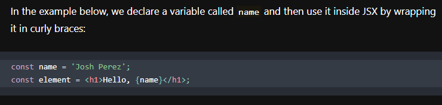

[Source of the example](https://reactjs.org/docs/introducing-jsx.html) - the part about JSX being used in React I remembered from class.

I have used this featuer several times in referencing dynamic elements in the simple notes app I’ve written in React just to learn via practice. I think this below is another good example of such code, I don’t recall links working this way in vanilla HTML – if I remember correctly they had to be specific locations, either a path (to a folder, and then it reads the index.html of it or whatever is set as the index) or a specific page (like “page.html” or some file or anything, but I don’t recall it using dynamic variables in links – at least not in HTML 2.0, I can’t be sure about 5.0 as I haven’t fully updated my knowledge as there was yet no need to).

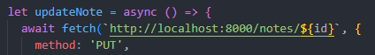

The link contains a dynamic ID as a part of the link actual.

This is the main feature of React, that it’s component based, and we rotate these components to make up page views from their amalgamate. I think I’ve also answered the **“what’s the benefit of using React”** and **“why choose React over HTML and CSS stack”** questions – it does the same work in a faster and more lightweight way.

#### What is a virtual DOM?
The other big plus of React is its virtual DOM feature. A DOM is a “document object model”, which is a model that creates object from our document. It is used in several languages I read, for sure in HTML, so I’ll stick to this example. It makes a tree “map” of HTML elements, they become nodes, and this is meant as a way to facilitate (simplify, hasten) performing operations on these elements (I understand that it achieves this by listing the elements and actually turning them into workable objects, so a list of workable objects – something like indexing in SQL databases, so we could address the elements which interest us faster thanks to this “table of contents” rather than traversing through all the elements to find all the objects we want to interact with). 

A sample HTML page structure:

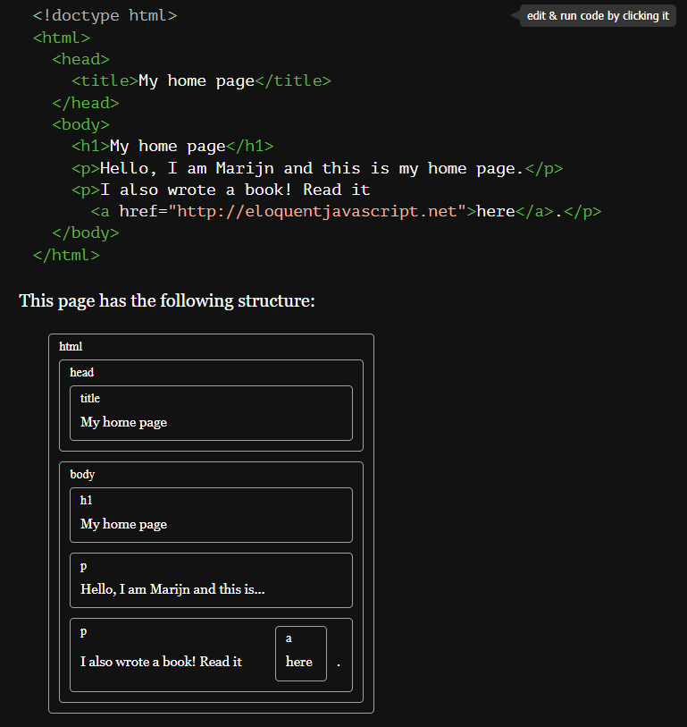

And this is the DOM representation of this HTML page structure:

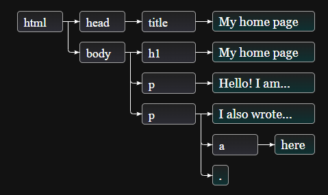

This DOM is however described as slow and bulky, an issue which is addressed by the React’s (and Vue’s) virtual DOM feature, which is an abstract DOM with each node from the real DOM represented (in the virtual DOM, each real DOM node has its virtual DOM counterpart) – I might be wrong but from the explanations I’ve read it seems like an index of the DOM “index”, so less bulky means we can find the nodes we want faster. Then after the virtual DOM received some changes/updates, it compares the current state of its virtual DOM nodes with the real DOM nodes’ state (diffing – it understands which virtual DOM components were updated), i.e. talks with the “real” DOM and updates (as 1 bulk update – a lot of changes can be made in the virtual DOM, but they get batched into 1 bulk, 1 update applied to the real DOM – which positively influences the speed) only the components which need to be updated, without the need to update the whole DOM or reload the whole page’s content. 

I really like how this was showcased during the class, clearly showing us that the virtual DOM updates only the page element that is changed, and thanks to that the change occurs really fast, and that thanks to virtual DOM there’s no need to update the whole window’s worth of page. That was a very neat hands on example which spoke volumes to my imagination and memory.
So in short, thanks to virtual DOM we have faster operating (updating, changing) interfaces. Importantly, ReactDOM is not the “virtual DOM” feature of React. To quote React’s own words about this: The virtual DOM (VDOM) is a programming concept where an ideal, or “virtual”, representation of a UI is kept in memory and synced with the “real” DOM by a library such as ReactDOM. This process is called reconciliation. - so the ReactDOM is the middle man between the virtual DOM and the real DOM.
I thought to write it here (and check it for myself too) cause I think this could potentially be easily confused, and ReactDOM isn’t the virtual DOM.

Reading materials perused before formulating this answer: [DOM](https://eloquentjavascript.net/14_dom.html) ; [Real DOm vs Virtual DOM](https://reactkungfu.com/2015/10/the-difference-between-virtual-dom-and-dom) ; [DOM Types](https://anil-pace.medium.com/shadow-ec3d3806c621) ; [React Virtual DOM](https://www.codecademy.com/article/react-virtual-dom) ; [React FAQ](https://reactjs.org/docs/faq-internals.html)

## 2. What are Props? What is State? What is the difference between them? (10 marks)
**Props** are properties, attributes passed for React to work with. It is an object argument with data describing a property (one property) which can be used in both objects (const elements) and functions as well as classes. This way we can pass this property further, reference it, and this property can be dynamic, I’ve used ID of a singular note as a prop – the prop ID was an attribute of a note object, which allowed me to differentiate between several notes in the app and call only 1 of them, which had a certain ID. The calling function was 1 function, just the ID prop was dynamically changed.

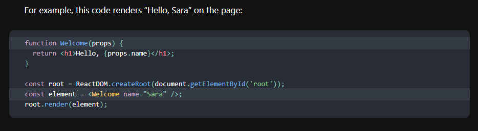

This example comes from the [React Official Website](https://reactjs.org/docs/components-and-props.html)

I also found this link useful when researching this topic when I was making the “learning react” app: [React Props](https://dmitripavlutin.com/react-props) 

The **state** is different than props by that it’s not passed between React components, states pertain to only 1 component – this component manages the state object argument internally. State is also a kind of a property of a component, but unlike props, state is mutable and meant to track changes to the object. It has the setState() function which updates the state of the object and re-renders it accordingly as well especially for that purpose. I don’t imagine I’d find any better explanation than the one on the React website, so this time I’ll just use a quotation: “setState() schedules an update to a component’s state object. When state changes, the component responds by re-rendering” (from React's Official Page). An example of this which I found online uses clicks of a button to showcase the usefulness of state, which to me makes sense:

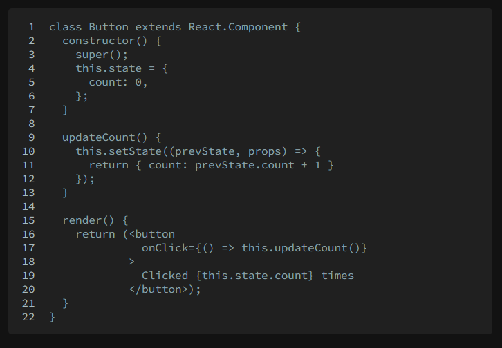

This example was in [an article](https://lucybain.com/blog/2016/react-state-vs-pros) linked from the React Official Website.

The **differences in use between props and state** – they are both attributes of React components, but one is for a changing attribute (state, it can be mutated), so if the component’s attribute should be updated / updatable, state should be used, and the other one – props – is static, as in it doesn’t change (props, can be set by the super class when they are created, but that’s it, they’re not mutable, there’s no function to access and overwrite/update them).

I’ve also came to know descriptions “**stateless**” and “**stateful**”, first means the component has no state, only props, and the latter means the component has both props and state attributes. There was also an opinion which I understand vaguely, that stateless components are simple, and stateful ones increase in complexity and decrease in predictability (my understanding is it’s because state is mutable) and that state is optional and best not to use it, unless necessary. Which actually explains the side note that components are initially all stateless (the part about state being optional). However, it’s still clear that in some components state is a necessary property, so it still has its own particular use, and that’s why it’s not deprecated.

Reading materials perused before formulating this answer: [Props ve State](https://github.com/uberVU/react-guide/blob/master/props-vs-state.md)

## 3. What are React Hooks? How do they differ from existing lifecycle methods? (10 marks)

React Hooks were implemented at the same time as a bunch of features they replace were removed. Previously to this implementation, class components had parameters like location, id and history, and now they do not have them. When I was writing that note app I bumped into several major issues because the original app in tutorial was written using class components and ID was accessed and it used to be possible to use the “matching” function on that parameter, and I had to transpile everything to function based components, and couldn’t use the previously available id or location attributes as they were deprecated. Function based components do not have such parameters, but now they have the hooks instead. Hooks come from the concept of functional programming (whereas class is a very OOP concept) and can be explained as side effect handlers. Function based components which are being promoted now (classes still exist, just are being discouraged to use in new projects) can only operate with the data inside the function unless something is injected/hooked to them. Because the parameters that the tutorial class used – namely the ID – were not available, I have used the useParams() function instead. There are also useState() and useEffect() among others – these are functions to aid our function based component. Class based components can’t use these hooks, they can be only used by the function based components. 

One more feature these hooks provide seems to be allowing the function based components remain stateless (as mentioned in the previous answer, stateful components are tricky and should be considered as optional, preferably avoided) becausese these hooks operate with states and side effects such as useState() and useEffect() or useParams(). So the functional  components can both access the state and remain stateless, because hooks do not alter the component to become a stateful one, while still providing the possibility of using a state variable in the component.

Hooks can’t be used in classes and lifecycle methods can’t be used in functional components. It’s possible to use useEffect() to achieve the same effect as with componentDidMount(). It seems that the hooks are more flexible than the lifecycle methods and allow for user customisation, as in you can make your own hook if needed, and lifecycle methods seem to lack this capability.
I understand on the face value of this information that hooks simplified life for the React developers, and I can use hooks, but I’m not very big on functional programming and have been mostly studying OOP so while I felt immediately comfortable with React’s class based components, I had to separately study the function based ones and I’m not so confident here yet, can use it, but I don’t feel like I have a solid understanding of this topic. For me the class based components were easier and more understandable, very likely that because of my “learning heritage” of Java and other OOPs. Maybe I should be grateful for React for broadening my programming horizons :) 

Reading materials perused before formulating this answer:  [Hooks Overview](https://reactjs.org/docs/hooks-overview.html) ; [This Comment from React.js Reddit](https://www.reddit.com/r/reactjs/comments/g5zxkp/comment/fo6pxl2) ; [Hooks Fundamentals](https://www.freecodecamp.org/news/react-hooks-fundamentals) ; [Lifecycle Methods](https://programmingwithmosh.com/javascript/react-lifecycle-methods) ; [What's a Component Lifecycle](https://blog.logrocket.com/react-lifecycle-methods-tutorial-examples/#whatisthereactcomponentlifecycle) ; [This Comment from React.js Reddit on Lifecycle Methods](https://www.reddit.com/r/reactjs/comments/d4r6fu/react_lifecycle_methods) ; [Lifecycle Methods and Hooks](https://www.opcito.com/blogs/lifecycle-methods-and-hooks-in-react) ; [Lifecycle Methods and Hooks Suspense](https://dmitripavlutin.com/react-fetch-lifecycle-methods-hooks-suspense) ; [Hooks Fundamentals](https://www.freecodecamp.org/news/react-hooks-fundamentals) ; [Component Lifecycle Methods vs Hooks](https://tsh.io/blog/react-component-lifecycle-methods-vs-hooks) ; [Replacing Lifecycle Methods with Hooks](https://blog.bitsrc.io/replacing-react-lifecycle-methods-with-hooks-a-comprehensive-guide-dfd5cbe1f274)

## 4. Design the perfect door - what should it look like, what are the components for it? What design heuristics should it follow, and how does your design match? What made you choose this design? (20 marks). (Consider in particular (likely need to do independent learning): who are your stakeholders? What are their personas? What are the doors requirements and how will your stakeholders benefit from your solution?)

The perfect door (perfect is subjective, so this is my opinion) for me is a door that opens both ways and does not require hands to operate. When working in the office and also when moving around the house, very very often I am carrying something in my hands – at the office it was usually a laptop, notebooks, pens and a cellphone in one hand, and my jug of tea in the other. At home I live upstairs and the kitchen is downstairs, I usually take empty plates and minor trash on my way down and bottles full of water for plants and some snacks or a jug of tea in the other hand. Either way, usually both of my hands are occupied, so doors with a handle that cannot be pushed down even with an elbow or just the small finger is a nightmare – those with the revolving door knob which has to be grabbed with a whole hand and turned then pushed in order for the door to open.

The look of the perfect door for me is not gravely important, door is a tool in my mind so my approach is pragmatic – it should serve its purpose of holding the air (temperature) in, holding my cat in and being a decent barrier, but one that can be very easily opened and closed, preferably without hands, with a tip of small finger or with my elbow but preferably just by pushing towards the door with my back, arm or hip.

However, since this is about the perfect door, for me it should be transparent, a glass door is good for me. In the office one rarely needs the privacy of a closed room and non transparent door. At home I guess only the bathroom and bedroom would require opaque doors. Since it was not pointed that this should be a bathroom or bedroom door, my perfect door is transparent, glass door, because it gives me the feeling of safety to see what and who is behind the door, also, at home I’ve decorated my rooms so that they are pleasant and I like looking at them, doors obscure the view, and also this allows sunlight to go into the rooms which normally would lack it with doors closed. I’d have several rooms which would greatly benefit from having a transparent door – for example a small orangerie, home jungle, which looks lovely and that room has a lot of light, but I tend to keep the doors closed because of my cat, who shouldn’t go there unsupervised. Kitchen doors would also be good as transparent ones, keeping the smells in, but letting the light reach the corridor.

Further, because I am on the pedantic side and I’d loathe the view of fingerprints on the transparent glass, the door should have a flat rectangle space, can be made of non shiny metal (so like powdered, matte) or perhaps some sturdy plastic in a neutral colour where this door could be pushed by hand to open without necessarily touching the glass part. In order to keep the door clean this space should be big, maybe 10-20% bigger than a hand of an adult men in both x and y directions. Matte makes fingerprints less visible too. Dark colours only, metal or black preferable, so fingertips would be less visible. This spot should be on a convenient hand reach height, which in Europe where our average person’s height is about 170cm tall should be around 120-130cm (I just checked what height the comfortable door knobs are at).
I hope the above description is a detailed enough explanation about “why I have chosen this design”.

Also, my perfect door is necessarily a door which opens BOTH ways, so can be pushed both on the way in and on the way out of the room, is a benefit because you will never have to guess whether to push or pull – push is always good, pull is always good as well, although there’s no handle to catch and pull the door by, so not advised. That removes any and all uncertainty about the door’s use.

Because the question is about the perfect door and that’s subjective, I understand I am being asked about my opinion about perfect door for me, so the "stakeholders of my perfect door" is actually me. Although from what I’ve seen around any office I’ve been to, I’m pretty sure my door would accommodate great more people than just me alone. The persona of my stakeholder, so me, is a pedantic person, hence the dark “door handle” flat spot; someone who’s on the autistic side and does not like surprises, hence the transparent door; likes sunlight and pretty things, hence the transparent door; and who’s pragmatic enough to take everything that needs to be carried in 1 trip (so doors must be able to be opened without the use of hands) – although granted, I know many people who also hate doing many trips and will rather carry a wibbly wobbly pile of stuffs like an acrobat than make more than 1 trip. My stakeholders would benefit from my door by not being forced to use hands to reach and manipulate the door knob, which wouldn’t endanger the wibbly wobbly pile of stuff they’re carrying each time. They would also benefit from seeing who’s in the room which is a pretty good tell about the type of meeting inside, giving a brief while for “heart & mind preparation” (a nice term I’ve snatched from East Asians) not to waltz into the room with an inappropriate mood or style or moment.

#### Design heuristics:
- ##### 1/ Visibility of System Status
Perfectly clear with my door, by the position of the door push flat space it’s possible to say if the door’s closed (flat space floating rectangurality around 120-130cm height) and needs to be pushed to be crossed or open. As a bonus we also get the status of the room behind the door visible.
- ##### 2/ Match between the system and the real world
I’m pretty sure a door with only 1 visible “function” feature (that flat rectangle to push the door) is very clear on how to use the door.
- ##### 3/ User Control and Freedom
I’m sure this door’s design meets also this heuristic, the door’s user has full control on whether they open this door or not and the freedom of choice whether to open them or not.
- ##### 4/ Consistency and Standards
Eexcept the main front door, which absolutely need to be more sturdy, all other doors in any office and my home could be my perfect door, just bedroom and bathroom door should be opaque, but keeping within the standard described above (the only real feature of my door aside of “being made of glass” is that rectangle for pushing, so that’s the two standards). I’d also add the possibility to lock the door from inside for bathrooms, but that’s an easy add-on to be added on top of that rectangle.
- ##### 5/ Error Prevention
I saw such door in use, I think such door is pretty much idiot proof. It’s very clear what to do with that rectangle. The only possible error with glass doors is not noticing there is a door, but that’s mitigated by the +10-20% average hand size rectangle for pushing on the door. That’s at least 30x30cms size rectangle. Even a person with bad eyesight would notice a big black or dark metal floating rectangle and thus notice there is a door.
- ##### 6/ Recognition Rather than Recall
Totally "check!", as above – it’s very clear what to do with that rectangle "floating" at hand height.
- ##### 7/ Flexibility and Efficiency of Use
Also completely "check!", that’s the main purpose for my perfect door to be used easily, hands free, without the necessity to operate handles by hands.
- ##### 8/ Aesthetic & Minimalist Design
Well, this door is transparent with only 1 visible element without any decorations, so I’d say this is almost as minimalist as it gets (removing that rectangle would be possible and admittedly more minimalistic, but would decrease the intuitiveness of use, increase the possibility of errors (bumping into the door not noticing them since they'd be completely transparente) and admittedly less aesthetic – within half a day in any office and that door would have fingerprints stamped half over them).
- ##### 9/ Help Users Troubleshoot Errors
Even if someone would be looking elsewhere while walking and bumped into this door, with regular walking speed that wouldn’t hurt neither the person nor the door, and the person would notice the “floating” rectangle within seconds and recognise the door.
- ##### 10/ Help and Documentation
I don’t think I’ll ever write any how to use documentation for a door :) even those “more complicated ones” with handles :) I’m sure that documentation or help file would be completely superfluous in case of the door described above :)

So my door meets all the heuristics (maybe save for the 10th one?), yay :) That surely means it’s a good door, right?

Reading materials perused before formulating this answer: only got the [list of 10 heuristics](https://www.nngroup.com/articles/ten-usability-heuristics) from the internet.

## 5. What is Angular, and how does it differ from React? You may need to conduct independent research and learning for this (10 marks)

I’m going to make this question my own study and 1 up this question by throwing Vue.js in as well into this comparison – I want to know the answer anyway :)
(Please forgive the longer answer for the sake of learning curiosity of your eager student :) )

#### What is Angular:
Angular, not to be confused with Angular.js which now refers to the Angular versions pre Angular 2 release in 2016 by Google which “completely rewrote” previous Angular.js versions (which existed since 2009), is an open-source JavaScript framework which facilitates building user interfaces (UI, frontend layer). 
It makes use of the Model View Controller (MVC) architecture, reusable components, HTML extended with Angular directives and TypeScript, and it employs only the real DOM making it slower than React and Vue. It’s a full fledged framework, there’s more to learn here than in the other two in order to use it well: directives, modules, decorators, components, services, dependency injection, pipes, and templates. That's only the start too. More advanced Angular will have you learn about change detection, zones, AoT compilation, and RxJS.

#### What is React:
React, more accurately React.js, is a JavaScript library which facilitates building user interfaces (UI, frontend layer) created in 2013 by Facebook (not open-source). It is not a framework because it lacks the model and controller layers, does not allow for making full applications only with React. 
This library makes use of the component based programming, props, and employs a virtual DOM which translates to faster execution and more accurate updating of the real/actual DOM. (more details about React in the 1st answer “what is React”, so cutting this answer very short here).

#### What is Vue:
Vue, more accurately Vue.js, is an open-source JavaScript library which facilitates building user interfaces (UI, frontend layer) created in 2014 by Evan You (after his experience with working with Angular.js at Google – he wanted to build on what’s good in Angular.js and make it even more useful and lightweight). While it is possible to use some Vue.js (thus fitting in the definition of a library), it is also called a JS framework (although a very bare bones one). I’d lean to call it a library also because it is not standardised (opinionated), but I see that the jury is still out on this one, and the fact that the line between “library” and “framework” definitions is somewhat blurred does not help making a clear cut binary distinction “it is a library” or “it is a framework”. It makes use of the Model View ViewModel (MVVM) architecture component based programming, props, and employs a virtual DOM which translates to faster execution and more accurate updating of the real/actual DOM. 

Its core features are:
– “approachable” – thanks to the incremental nature of Vue.js adoption, the developer can employ exactly as much Vue.js as they need. It uses already well known HTML, CSS and JS languages, decreasing the learning curve (learning new gizmos like JSX not required). It’s also open source, and as most such projects, it can boast a robust and very engaged and supportive community.
– “versatile” – comes with an abundance of useful and necessary libraries such as Vue Router. Incrementally adoptable means the dev gets to freely decide how much Vue.js to use in their project.
– “performant” thanks to the employment of virtual DOM – rarely needs to be manually optimised.

Its possible minuses are that it’s too new and thus underdeveloped, too lightweight and thus limited, and too unopinionated leading to irregularities due to too great a flexibility.

#### Comparison – general, in my words:
**Angular** is the slowest (2way binding & dirty checking makes it slower, working on the actual real DOM also makes it slower), bulkiest framework from these 3, with highest learning curve (got easier with TypeScript innovations, but still the highest of the 3, most complex syntax, and most opinionated of the 3, however that can be a plus for some projects i.e. corporate big projects and for users preferring higher standardisation. For example, for people acquainted with OOP, dependency injection shouldn’t be a novelty to be learned) and most issues (1110 compared to 761 in React and 343 in Vue – from their GitHub pages: [Angular](https://github.com/angular/angular) ; [React](https://github.com/facebook/react) ; [Vue](https://github.com/vuejs/vue) ). It came to existence first of the three. It’s the most standardised (opinionated) of the 3, a full fledged framework, while the other two are actually libraries (smaller, more lightweight and less opinionated).

**React** has a lower learning curve than Angular thanks to less complex/more readable syntax, is more lightweight and faster due to the virtual DOM, less issues, more flexibility (choice of libraries – less opinionated/standardised). It came to existence second to Angular. It may be more difficult for those who don’t feel comfortable with increased flexibility/freedom of choice and prefer to work with a more opinionated framework such as Angular, with more things defined and chosen for them already. Additionally, with recent departure from class based components into the direction of function based components and functional programming implementation, React can be more difficult to learn/master for those devs with more extensive OOP background or simply preferring it over functional programming.

**Vue** should have the smallest learning curve of the 3 given it doesn’t have any new inventions like TypeScript (Angular) or JSX (React) involved, is the most lightweight (even to a degree this can be a minus) of the three and also has a virtual DOM like React. It has the least issues on GitHub (see above in Angular), is the newest kid on the block, which means it may be underdeveloped (one of the minuses of Vue) but is also fully open source and with an active community (this means a lot of support available).

#### Comparison – Angular vs React & Vue – 2way & 1way Data Binding:
Important side note about Angular & React: it is often mentioned that “Angular employs 2 way data binding” and “React employs 1 way data binding”, which means that in 2way binding if the UI is changed then the model state changes automatically, and the reverse is also true, while in 1way flow changing the UI elements is possible only after changing the model state. I did read that Angular’s way leads to less errors but in practice in code I don’t yet understand what this means. It was also mentioned clearly that 2way binding of Angular necessitates “dirty checking” and makes the flow slower. 
I also read about Flux in React as the means for Facebook to implement the 1-directional approach:

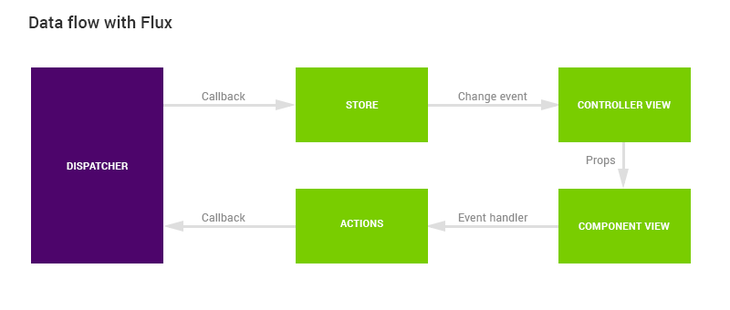

#### Comparison – in a table, side by side detailed comparison view:

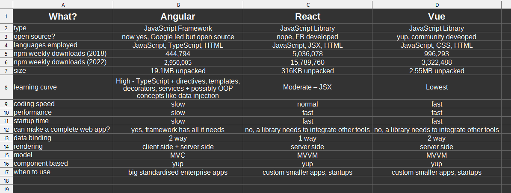

Reading materials perused before formulating this answer: [React.js vs Angulrar 5 vs Vue.js in 2018](https://medium.com/techmagic/reactjs-vs-angular5-vs-vue-js-what-to-choose-in-2018-b91e028fa91d) ; [React.js vs Angular](https://appinventiv.com/blog/react-vs-angular) ; [Differences Between React and Angular]( https://dzone.com/articles/differences-between-react-and-angular) ; [React vs Angular](https://x-team.com/blog/react-vs-angular) ; [Vue.js](https://vuejs.org) ; [Why Use Vue.js](https://www.trio.dev/blog/why-use-vue-js) ; [Vue.js Comparison with Angular and React](https://www.valuecoders.com/blog/technology-and-apps/vue-js-comparison-angular-react) ; [React vs Angular.js](https://rubygarage.org/blog/react-vs-angularjs) ; [Angular vs React Comparison](https://brainhub.eu/library/angular-vs-react-comparison) ; [React vs Angular](https://www.sitepoint.com/react-vs-angular) ; [React vs Angular vs Vue Complete Comparison](https://dzone.com/articles/react-vs-angular-vs-vue-the-complete-comparison-to) ; [Angular vs React Side by Side Comparison](https://www.pluralsight.com/guides/angular-vs-react-a-side-by-side-comparison) ; [React vs Angular](https://programmingwithmosh.com/react/react-vs-angular) ; [React.js vs Angular.js](https://www.rishabhsoft.com/blog/reactjs-vs-angularjs) ; [React vs Vue](https://hackr.io/blog/react-vs-vue )

## 6. Please describe Redux in as much detail – especially consider: why would someone use it? What is it? What's the benefit of using it? Are there any potential drawbacks to using it? How can it be added to a project? What is dispatch, provider, actions, etc? (15 marks)

#### What is Redux?
Redux is a library which is a state container, meaning it manages and updates the states of components in the application using actions (events). It systematises the way states are being updated by defining when, where, why, and how the state in your application is being updated, and how the application logic will behave when those changes occur. While Redux can be used with any UI framework or library, it’s mostly used with React. React uses Redux in to cut down (delegate and facilitate) the hassle of storing and managing component states which is especially useful in large-sized and complex applications with a lot / big dynamic elements. The globally managed states of app elements are stored in a “store” which can be accessed using a “provider” – a component thanks to which components gain the ability to access (dispatch, so send state / state updates to the store, or fetch, so receive the states from the store) the states stored in the “store” using a “connect” function. According to several sources, that’s literally the only thing the provider does, it just grants components the ability to access the “store”. Any component wrapped in the “provider” can access the “store” via connect function and get the “store” passed down as an attribute (or list of attributes), but needs to be wrapped with the provider - the access to the global store is granted also to their child components, that’s why a provider with only 1 element inside, <App /> works fine – it means all components of this application can access the global state store:

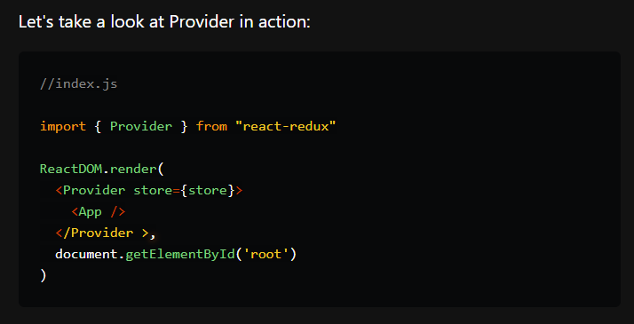

The global “store” with easily (clearly) defined access point (provider) is useful as it simplifies the way in which components can submit and retrieve states, which also means that the components wrapped in the provider so granted the access to the store can access other components’ states because all the components listed inside the provider (wrapped in it) use the global store – this means the states of all these components are stored in the global store, so any component with access to that store can access not only its own but all the data that’s stored in the store, other components’ states as well. This simplifies the process of “exchanging” state information between the components. This renders passing the state properties to other components obsolete.

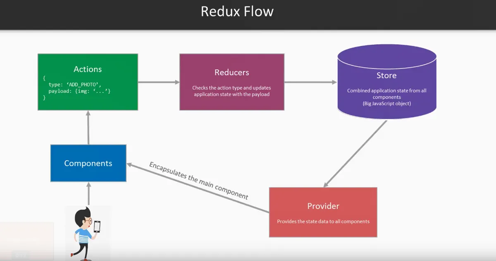

There should be only 1 store for the whole app, it’s global anyway, so it’d be unnecessarily complicating things to make more than 1 store.

#### Why whould anyone use Redux?
As per the “why would someone use it”, as said, it’s particularly useful for large apps or apps which have a lot of stateful components (which as discussed previously, is optional, a bit unstable, tricky and error prone, and should only be used when necessary, it’s best to keep components stateless) which are often updated or have a complex updating logic. Even the Redux website says that Redux requires writing more code and might not be suitable for smaller applications (that’s one “potenetial drawback of using Redux”). 
However, that said, since it neatly delegates the state management and greatly facilitates the process, it might be useful even for applications with a simple log in functionality, so that the logged in state and logged out state are properly reflected and easily managed. I could understand the benefit of Redux supported login reflected on a NavBar for example, showing different links after login. During class the shopping cart example as also very clear on why using Redux could be beneficial.
Alternative to delegating state management to the Redux’ global store is managing all dependencies and state updates basically manually so that’s a pretty big incentive.

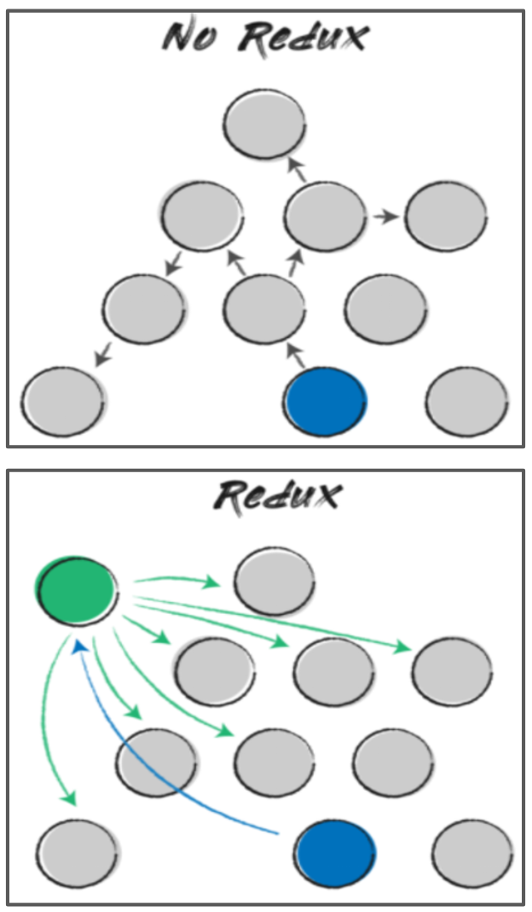

#### What are actions, dispatch, provider etc?
Short answer: this is how Redux manages the state updates (sending, validating a request, updating the store, retrieving the state info from the store).
The provider was already described, its sole purpose is to grant access to the global state store to elements wrapped in it. Actions are Redux speech for events, in Redux words - “A plain object describing the change that makes sense for your application”. These objects we dispatch to change the state in the store – it performs an action of changing the state (and thus the whole store actually, as 1 change changes the entire store). Dispatch is a function that dispatches these actions (sends them off, directs them, channels them). On the opposite fetch is a function to retrieve the status from the global store and bring the action to the component. In between all of this there are “reducers”, which are the agents responsible for determining precisely what state should be updated in the store and in what way – it contains logic for validation of the requests to the store and this component’s role is to make sure the change it receive (the payload, data passed in the action) is applied correctly. This is important because they overwrite the states in the store.

#### How to add Redux to a project?
Pretty much like all other packages/libraries/modules, so they need to be installed into the project. In case of React, we can use package manager such as npm or yarn to install the library packages. With npm, typing the command “npm install redux” will work, while with yarn the only difference in Redux installing command is the npm vs yarn installation command, so “yarn add redux” will work, the redux package name remains unchanged because we still want to install the same package/library/module. 

To answer this question I’ve rewatched the CFG session on React testing and Redux. Additional reading materials perused before formulating this answer: [How does provider and connect work in React Redux?](https://stackoverflow.com/questions/48227188/how-does-provider-and-connect-work-in-react) ; [What is a provider in Redux?](https://javascript.plainenglish.io/what-is-a-provider-in-react-redux-ed5f6991550c) ; [Redux: What is a provider?](https://dev.to/am20dipi/redux-what-is-provider-236j) ; [Why do React developers love Redux for state management](https://hub.packtpub.com/why-do-react-developers-love-redux-for-state-management)

## 7. Please describe Linux in as much detail as possible (feel free to use notes made during lessons, or draw from the lesson directly!). Especially consider: what is its history? Why would someone use it over other existing operating systems? How does Windows and Mac OSX differ to Linux? How does Linux function, what are some unique features to it? How can it be installed today? (10 marks)

#### What’s Linux History?
Linux is an OS (operating system, the main and most major program on any computer which allows communication with the computer, steering it to perform actions, receive and output data etc.) created by Linus Torvalds of University of Helsinki using a GNU (according to Wikipedia, an acronym for “GNU is Not Unix” – an extensive collection of free software, a lot of them written in C OOP programming language) C Compiler. He has created the Linux OS kernel based on MINIX. He aimed to use the functions of his PC with an 80386 microprocessor and wanted to write a program for his hardware independent of any other OS. After creation, it was first distributed as a source code (0.01 version) in 1991 and then as a bootable floppy disk image with Linux kernel and a set of GNU software (tools). The installation was not an easy process however, so a variety of Linux distributions sprang up to ease the installation up - H. J. Lu’s “Boot-root”, a downloadable disk image pair including Linux kernel and the minimal tools was probably the first Linux distribution available released in 1991. Other early distributions include MCC Interim Linux, Softlanding Linux System or SLS, and Yggdrasil Linux/GNU/X, all in 1992. In December 1993 Ian Murdock created and released Debian as a free Linux distribution. Slackware and Debian are the two oldest still running Linux distributions.

Linux distributions garnered positive responses from the users as the alternative to DOS and Windows in IBM PC compatible machines, Mac OS the Apple Macintosh computers, and as UNIX’s proprietary versions. UNIX was mostly used in schools and/or workplaces. Linux distributions were appreciated for being low-cost or completely free and for providing source code.

Presently Linux can run TCP/IP, X Window System, Web, Emacs, mail and news software, and much more. Every major software package has been ported to Linux. Also, commercial software is coming to the public. Today, many software developers begin their development journey with Linux apps. It’s popularly used on servers, but on personal computers it’s still a niche OS due to comparably still complicated installation, requiring bits of programming savvy from the users, and due to not being compatible with still many commercial software (for example, SDL Trados, a main CAT (computer assisted translation) software for translators which is required in many commercial translating projects, was unavailable on Linux when I was a translator. Many games also don’t bother creating a Linux version as not many PC users have Linux on their PCs).

#### Why would anyone use Linux over Windows or Mac?
- ##### 1/ Security
The security aspect was kept in mind when developing Linux and it is much less vulnerable to viruses compared to Windows. Programs cannot make any changes to the system settings and configuration unless the user is logged in as the root user. Most users do not log in on the root, as it is not necessary; hence, they cannot do much damage to the system, except to the non-essential user files and programs, since the malware will simply have limited access privileges. Windows is infamous for being the most virus and malware prone OS.
- ##### 2/ Stability, Reliability
The Linux system is very stable and not prone to crashes. It operates at the exact same speed as when first installed even after several years. The uptime for the Linux servers is very high and the availability is around 99.9 per cent.
- ##### 3/ Easy Maintenance
Maintaining Linux OS is easy as the user can centrally update the OS and all software. All of the Linux distributions have their own central software repository, which is used to update the system and keep it safe. The updates come out periodically, can be installed with just a few clicks without the need to reboot the whole system, and the users can also choose to automate this process. Windows OS runs slower with time as the temporary files and other files remaining after uninstalled programs pile up.
- ##### 4/ Flexible Customization
The installation procedure is very flexible allowing users to choose the modules they want to install and thus customise their OS up to their preference and specific hardware requirements. This allows them to install Linux even on old hardware, thus helping in optimal use of all the hardware resources. Whindows and Mac can't be customised almost at all in comparison, on OS level we're allowed to choose pretty much only the system language and localisation, timezone. 
- ##### 5/	It’s Free!
Linux is completely free and comes with all the basic software required by a typical user and even some for an advanced user. Businesses can also use this software free of cost and thus reduce their IT budgets substantially. Windows starts at 100USD and Mac is only sold with their very expensive hardware.

##### Differences between Linux, Windows and Mac OS?
- ##### 1/ File Structure
As Linux and Mac OS are both UNIX based their file structure is somewhat similar – both use a tree structure: in Linux we have a hierarchical progression from the root, and in Mac, the topmost file folder is the root directory and all the subfolders (sub-directories) branch out from there.
Unlike in Windows Linux has no drives. In Linux everything is a file, including external devices like hard drives, CD-ROMs, printers that show up as drives in Windows.
Also, unlike Mac and Windows, in Linux, you can have two files with the same name in the same directory, provided they use different cases.
- ##### 2/ All the points from the above question "Why would anyone use Linux"
- ##### 3/ It's Difficult
This is the main, most common and biggest reason why Linux remains niche despite all the previously mentioned pluses it can rightfully boast. While nowadays it's no more difficult in installation than any other OS, it's still more dificult to customise and use, and requires at least some programming savvy, talking with the computer via a Terminal/Powershell with commands. Great most computer users can't do that and are unwilling to learn that only to check their email and browse the internet.

##### How does Linux work?
A typical Linux system contains the following components:
- **Hardware layer**: This layer comprises all the peripheral devices such as (RAM/ HDD/ CPU etc.).
- **Kernel**: Linux's main component which is in charge of many of the Linux OS’ functions. It communicates with hardware directly and delivers low-level operations to upper-layer elements.
- **Shell/GCC**: It is a user-to-kernel interface (like: powershell, terminal – user uses it to communicate with the computer using commands the computer’s OS can understand and execute) that hides the complexities of the kernel's operations from users. The shell processes the user's command and performs the kernel's functions.
- **Application Software**: The desktop environment that comes with your Linux OS or that you choose to install will not be able to meet all of your application requirements; there are far too many, so not all software will be supported by Linux (meaning not all software can operate on Linux, not all of it has a Linux compatible version). Therefore, individual applications are installed. Most Linux distributions, such as Ubuntu, come with dedicated app stores to find and install the compatible software.
- **Bootloader**: Computers go through a startup process known as booting which is operated (supervised, executed) by the operating system. The bootloader of your operating system precedes the processes you can run and access when you turn on your computer.
- **Background Services** (“daemons”): Small systems which serve as workers in the background, assuring that critical tasks such as scheduling, publishing, and multimedia work properly. They begin to run once the user logs in into the computer or right after the system gets booted.

##### Linux unique features?
- ##### 1/ High Adaptability
Linux software operates flawlessly on a wide variety of hardware platforms, so people can use Linux operating system on nearly any computer without worrying about compatibility. It runs the same way on both high-end and low-end hardware.
- ##### 2/ Open source code
Its source code is available for anybody to use and alter. Many developers collaborate in organizations to improve and strengthen Linux, and lots of developers constantly work on updating the Linux system (strong community).

#### How to install Linux?
If someone who had no previous exposure to Linux would ask me this question, I’d direct them to the Ubuntu website and ask them to follow the installation guide there. I’ve several friends who are heavy Linux users, and they always said Ubuntu is the most user friendly Linux distribution because of its user friendly interface, most similar to other OS with a decent GUI so not requiring the user to extensively use the terminal/powershell command prompt to communicate with the OS. 

Basically to install any OS one needs a wiped HDD (Hard Drive, formatted, empty of files – if not empty, the installation will wipe it anyway, but that’s potential loss of files) and a bootable device with the OS image embedded (burnt) on it – in the days of yore this device used to be floppy disks, later CDs, now mostly USB sticks since fewer and less computers are equipped with CD drives nowadays. (this part applies to also Windows and Mac installations).

Then we restart the computer with the device plugged in to let the computer boot (start) from our prepared device with OS (using the OS from the device, not from the HDD) and initialise the OS installation, customise it as you want using the installation wizard (these things get so easy with all the GUI and interfaces and wizards and I think that’s great). Once complete, we have a fresh OS installation on our computer's HDD and you can use it right away.

It’s also possible to set up a computer to have two operating systems on the HDD, you can’t run both at the same time of course, but you can choose which to run (boot) and use when you turn on the computer (normally you’d have only 1 OS, so it would boot up automatically, but with dual OS setup, you are asked to choose which one do you want to boot first before any of them boots up).

It’s just that you will have a partition sliced out from your HDD for each OS separately (so for example, with 1 TB HDD, 500MB would go for a partition for Windows, 500MB for a partition for Ubuntu. Or however many MB you want to ascribe for them when partitioning).

Reading materials perused before formulating this answer: [Wikipedia: GNU](https://en.wikipedia.org/wiki/GNU) ; [Wikipedia: Linux](https://en.wikipedia.org/wiki/Linux) ; [Linux Official Website: What is Linux](https://www.linux.com/what-is-linux) ; [Red Hat: What is Linux](https://www.redhat.com/en/topics/linux/what-is-linux) ; [History of Linux](https://linuxhint.com/history-of-linux) ; [Linux Features](https://monovm.com/blog/Linux-Features) ; [Reasons to use Linux](https://www.opensourceforu.com/2020/03/reasons-to-use-linux) ; [Linux vs Mac vs Windows](https://www.educba.com/linux-vs-mac-vs-windows) ; [Differences Between Mac Windows and Linux](https://shiftweb.com/the-differences-between-mac-windows-and-linux) ; [Ubuntu Official Website: Install Ubuntu](https://ubuntu.com/tutorials/install-ubuntu-desktop) ; [FreeCodeCamp: How to Dual Boot Linux with Windows](https://www.freecodecamp.org/news/how-to-dual-boot-any-linux-distribution-with-windows) ; [OpenSource: Dual Boot Linux](https://opensource.com/article/18/5/dual-boot-linux)

## 8. What are they, and which is better between Class components and Functional components? Provide a discussion. Consider: Go deep – how does each one work? What is the unique properties or behaviours to each one? Why would someone use one over the other? What are the advantages and disadvantages of each one? Who benefits from these advantages and disadvantages, who is it suitable for? (10 marks)

While I come from OOP background and sense I might have a bias, as OOP uses classes so I was familiar with this concept, and React has class based components at first I kind of favored them, as much as I’d love to say “It’s not like one is better than the other. They’re different. Both are just tools.”, after reading a lot for the sake of answering questions in this homework (not only this one), I must yield and admit that in React function based components may be often the better choice than class based components. 

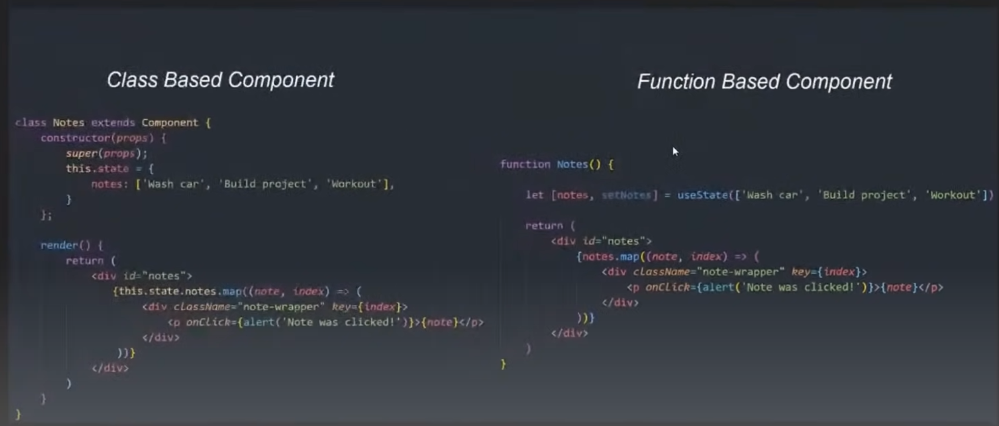

#### Function Based Component Pluses:
1 – shorter code, easier to read. Since functional based components don’t require the render() function this 1 word/line is omitted resulting in shorter code (also no need for “this” makes the code shorter too).
2 – no “this”. I personally don’t understand the hate, but seems many developers loathe this operator and rejoice in not having to do anything with it. Some developers also did not consider it as a plus, but as a minus, so I guess it’s a preference matter.
3 – easier to test. The part about testing and needing to remember what scope “this” means may be true, I lack experience in testing to be able to formulate an opinion on if its problematic or not and which is preferable/better. Another argument pro easier testing I found was that function based components are functions, and that’s why they’re easier to test. That makes sense.
4 – state and lifecycle accessible via hooks – no direct access, delegation to hooks. Hooks are more flexible, optional (need to basis choice) and customisable, and don’t affect the component, are just additions, plug-ins, so here even I can see how this is a plus potentially.

#### Function Based Component Minuses:
1 – new thing not documented so well. Just less documented really.
2 – higher level of abstraction. This can be a plus actually, greater abstraction is greater data safety, but abstraction is a complication in structure/logic, so can be also a minus.
3 – no state, no lifecycle. Functional based components can’t have state, can’t access lifecycle. Can be “imported”/”plugged in” via hooks though.
4 – need to have props passed as an argument to the component in order to work – no direct access.
In practice, this is an example how the class & function based components look like:
So yes, it is a few lines shorter. With larger programs this must make a world of a difference.

#### Class Based Component Pluses:
1 – can access lifecycle methods directly.
2 – can use “this” keyword. Reflects OOP languages.
3 – props can be directly accessed, making for easier access. No need to pass them down to the component.

#### Class Based Component Minuses:
Basically same as the pluses :D Also the pluses of function based component are class based components' minuses. 
Also, "wrapper hell". The reports of “wrapper hell” were a picture that’s worth more than a thousand words each time – that does indeed look like wrapper hell, so if function based components relieve the devs from this particular type of suffering, that’s a very good idea and should be supported and promoted.

#### Conclusion
From the abovementioned points it can be clearly understood that while some parts remain disputable, a preference between two things delivering same functionality anyway, one of these two comes with slight improvements of being shorter, easier to read, and arguably easier to test, and possibly even easier to use side effects on. So even if it’s 5% better, yes, it is just clearly better.

When researching this I’ve also stumbled upon descriptions of presentational components (which are only concerned about the UI, just used for US arrangement, so no need for state and lifecycle logic) and container components (which should employ state and lifecycle), so it looks like both class and function based components are still useful in React, even in the newest React version, just for different purposes. 

However, this used to be more accurately true when function based components simply did not have the features class based components had, so the ability to access state and lifecycle, but now with the  introduction of hooks they do, so it’s possible to use function based components as both the presentational and container type components. And therefore, because it is now possible, and function based components are admittedly simpler, the developers are encouraged to use this, and why not? If we retain the same functionality gaining additional easier readability, shorter code, more flexibility and better testing. (On top of which we even have Redux which can handle our hook accessed states globally for all components, so we wouldn’t have to manage them manually, like we would need to with class based components, making our lives even easier).

At the moment still some things can be done in both (class & function based components) in React and the developers said they’ve no intention on further nerfing class based components or removing this concept from React, but they’re also clear on their recommendation to use function based components in the new projects // projects from now onwards. 

Reading materials perused before formulating this answer: [Class vs Functional Components](https://bootcamp.burlingtoncodeacademy.com/lessons/react/class-v-functional-components) ; [Functional Components vs Class Components](https://codeburst.io/react-functional-components-vs-class-components-eb24b4fe0ad8) ; [Differences Between Class Components and Functional Components](https://medium.com/swlh/differences-between-react-class-components-vs-functional-components-2468e90f3857) ; [Why you should adopt React hooks instead of classes](https://blog.logrocket.com/why-you-should-adopt-react-hooks-instead-of-classes) ; [React Class Components are Dead - Hint - Not Yet](https://itnext.io/react-class-components-are-dead-hint-not-yet-1d0a151173b8) ; [Have React Made Classes Obsolete](https://www.quora.com/Have-React-hooks-made-classes-obsolete) ; [Why hooks are the best thing to happen to React](https://stackoverflow.blog/2021/10/20/why-hooks-are-the-best-thing-to-happen-to-react) ; [React hooks - Death of Classes and Lifecycles](https://medium.com/@jitin.maher/react-hooks-death-of-classes-and-lifecycles-c8db5956558c) ; [React Function Components with Hooks versus Class Components](https://stackoverflow.com/questions/53062732/react-function-components-with-hooks-vs-class-components) ; [React Hooks - Why we should embrace it](https://medium.com/@jackyef/react-hooks-why-we-should-embrace-it-86e408663ad6)
