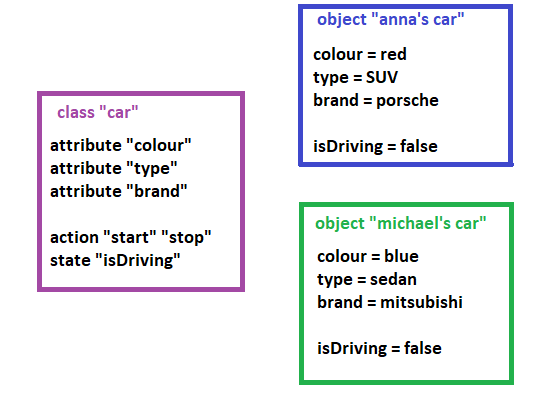
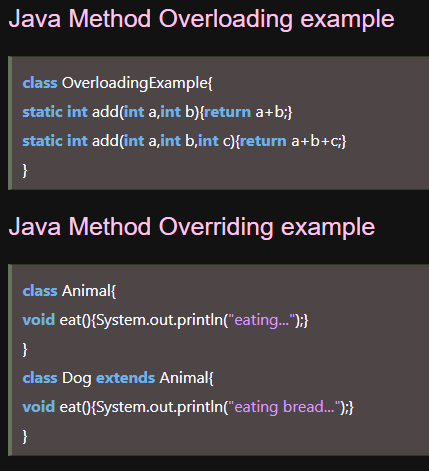
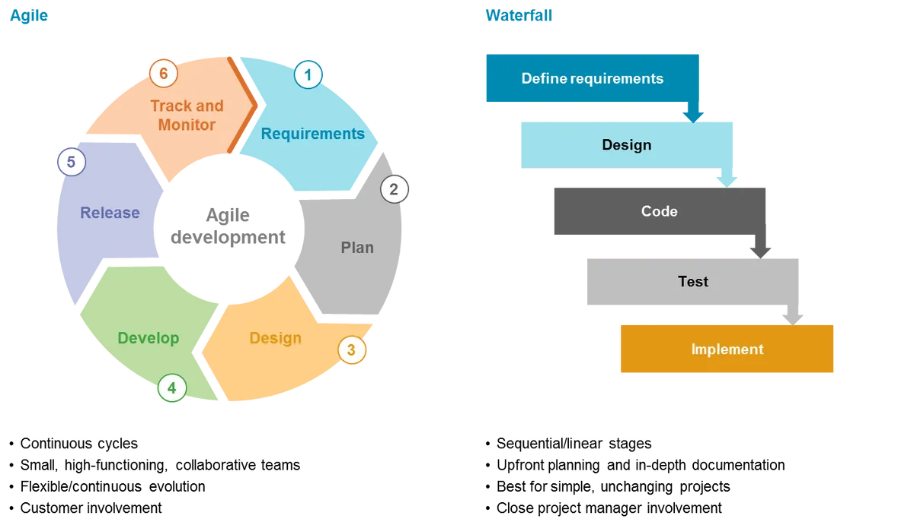
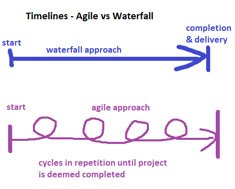

# HOMEWORK WEEK 3

##### This week’s homework is a research based one. You’ll need to conduct independent learning, in combination with existing material (where available), to answer the questions below. The reason for this homework is to ensure you are aware of critical topics in CS. These topics were difficult to cover within the existing lesson schedules, but due to their importance are placed within the homework instead. Make sure to research, learn and then answer the following:

## 1. What is OOP? How may you have already made use of it (e.g. class components)?

OOP stands for Object Oriented Programming. The idea of OOP revolves around an object – we create an object via instatiating a class, and then we can perform actions on this object or make it perform actions or change state. A class is basically a definition of what an object should look like and what it should do (or what state can it be in) – contains a list of attributes/properties describing the object. We can have a “car” class which will be defining that any object of this class (so any car) needs to have 4 wheels (a property, an attribute of the object), can have some colour of chassis (property of object – color), needs to have the start and stop driving action ability, and can be in one of two states, is driving or is not driving. 

This is my drawing presenting a class “car” which has 3 attributes, colour, type and brand, and 2 methods “start, “stop” and a boolean type attribute “isDriving” which can be false or true. In this example, an object of a “car” class can have 4 attributes and can perform 2 actions. In this example, the class “car” was instantiated twice, to create objects “anna’s car” and “michael’s car” – using the same template, we created 2 different objects – the attributes of these 2 objects are different, one car is blue, the other one is red for example, but both are still cars. The cars haven’t started driving yet, method “start” is available in both objects, can be used, but was not called yet. The state “isDriving” is false in both objects.

A class defining what our car object should be like contains a draft for a car, a definition, a template. Then by instantiating this class, so making 1 concrete instance of it, we create an object of this class. Only with a concrete, instantiated object of the class we can do things – perform actions. These actions, called methods or functions depending on the programming language, describe what the object does. We cannot call actions/methods/functions on a class directly, because a class is not a real / instantiated object, it’s just an idea, a definition, a template. To actually do anything, program a computer to perform some action, we need actual concrete objects, instantiated actual representations of the template, and we also need to define (also in the class “template”) the actions which we then can call on the object to make it do things. Even a simple addition functions need variable objects, and both the variables that are ingredients for the sum and the function need to be inside of a class for the function to be able to execute and add the variables together. 

Therefore in order to be able to have “object oriented programming”, we need 1 – a class defining 2 – an object with its properties and 3 – some method/s. 
Core concepts of OOP are inheritance, polymorphism, abstraction and encapsulation, and since I see they are actually listed below, I won’t expand on them here (although they have to be at least briefly described when someone is trying to explain what OOP is to anyone).

The answer to the second question is yes, I've used classes in Java (it would be either impossible or hard not to, I don't know any way to avoid using classes in Java and creating a working program in it), Java is one of the OOP languages. I know for sure that C languages, Python and JavaScript are also OOP languages. I knew Python wasn't a typed language and Java seemed more classic in this regard so I chose to start learning from Java, as I wanted to get to know the OOP concept well, and I had the notion that Python is too simplified and too forgiving for 1st learning - sure, would be easier and faster to learn Python due to it being more similar to the regular human language, so more readable with little programming knowledge, but I anticipated if later I'd try to go onto another language in the future, everything would seem comparatively difficult to Python for these reasons. And mostly I just wanted to get to know the OOP basic concepts well, and from what i gathered + advice from IT professionals friends, Java seemed better suited for htis than Python. C languages seemed too difficult and not as much used commercially as Java or Python, and JavaScript is my pet peeve (irrational personal reasons/opinion, JS seems messy and sometimes illogical too).

## 2. What is Polymorphism?

Polymorphism is one of the core concepts in OOP. By itself it can be somewhat easily (?) explained – if we have an “animal” class which already has attributes like “fur”, “breed”, “make_sound()”, “wag a tail”, “number of legs”, and a class “dog”, we can simply extend the class “dog” by the parent class “animal” to access all these attributes – that’s inheritance. The polymorphism part comes in realising these attributes – in “dog1” fur can be brown, breed can be german shepherd, “make_sound()” would be woof, wag a tail would be 1 and number of legs would be 4. Class “animal” might have different values set for these attributes, or no values. When inheriting, we can assign different values to the same attributes, so the parent class could for example have “make_sound()” set to “chirp” and then we overwrite it in out “dog1” instance to “woof” – that’s polymorphism. Polymorphism (the word) means “many forms”, so in our use here in OOP, this means that 1 object (for example – “make_sound()” method) can be overwritten from “chirp” in parent class to “woof” in child class. 

Polymorphism gets complicated because of 2 ways in which it is realised in OOP and they have utterly confusingly similar names – overriding and overloading. I’m not an English native speaker, so to me these 2 words mean exactly the same thing. In my language they both mean “overwriting”. Overriding versus overloading so in other names runtime versus compile time polymorphism (which again is tricky, because neither Java nor Python is a compiled language).

Apparently what I have described above, remembered and understood is “overriding”, so therefore we have an inheritance, the method has the same name and parameters, we just override the end result. This type of polymorphism requires inheritance, and the only thing changed is the end result. Method/variable name, parameters and their type remain the same, so “make_sound” needs to still be a string output, we just change the actual string output from “bark” (parent) to “woof” (child).

The second type of polymorphism is when we have a method, we keep the name, but we change its signature, so we might have a method like “make_sound(woof)” and then we use it as “make_sound(woof, woof)” so instead of taking 1 parameter in the signature the method takes 2 parameters. Overloading doesn’t rely on inheritance, it’s reusing the same method within 1 class.

It’s easy to justify both these instances of polymorphism:

Overriding is great with inheritance – we don’t need separate “make_sound()” methods for cats and dogs and birds, all these animals make sounds, we can just give each child class an ability to realise that method’s output differently, so to produce “woof”, “meow” and “chirp” respectively. 1 function gives 3 different results, so the code is reused.

Overloading is also for code reusing. I’ve seen a great example somewhere explaining this with an adding function “addition(var1, var2)”. Overloading allows us to change the number of parameters while keeping the function’s core idea/function, so if we suddenly have more than 2 numbers to add, we can use this same addition(var1, var2) function, just with a different signature, adding more parameters to it – addition(var1, var2, var3) - so we don't have to write a new function or alter the existing one (and then alter it back when we have 2 parameters again). The method name remains the same, just the signature differs. 

Source for the overloading vs overriding part of the answer: [Educative.io](https://www.educative.io/answers/overloading-vs-overriding)
Source for the visual example: [JavaTPoint](https://www.javatpoint.com/method-overloading-vs-method-overriding-in-java)

Side note: with the accessibility parameters polymorphism gets even more complicated . We did not have this in class because we’ve only had Python which does not have them, Java Script has them but we didn’t cover this in class. I’ve previously learned Java so I was made acutely aware of their existence. Accessibility modifiers are public (self-explanatory), private (limited to class only, class restricted), protected (package restricted + subclass outside package) and Java also has a default modifier (no modifier specified is default) which is package restricted without the exception for subclasses outside the package.
It would take me I think a bit too much space here to explain in examples how polymorphism works (or doesn’t) with addition of private and protected access modifiers.
I only wanted to highlight that with these access modifiers polymorphism may not work exactly as defined above and in the simple examples, because of the class accessibility. 
Access modifiers are very important for security reasons, but are complicated. Perhaps that’s why Python doesn’t have them, apparently no need for that there. Maybe if Python was being used in banking as extensively as Java is it would also get access modifiers. For Java Script it too makes sense, website security is an important topic.
I checked the accesses here to see if I remembered the access levels correctly: [JavaTPoint](https://www.javatpoint.com/access-modifiers)

### 3. What is Abstraction?

Initially I thought it’s just for the easiness of dividing the definition & template from the substance/realisation, that we hide backstage what is not immediately necessary and only have at hand the functionalities we need, but after reading, I saw that it’s more related to encapsulation and hiding the important data for security reasons. That also makes sense. So now I guess it’s both secure and cleaner code.

In Java there’s this concept of the abstract class & interface, which have a handful differences (for example, multiple inheritance, interface has it, abstract class doesn’t, abstract class can inferit from other abstract classes and interfaces, while interface only from interfaces, interfaces contain only abstract methods, abstract classes can have these and normal ones too) which are both a good example of “this is a template” kind of “thing” used for defining other things. I deliberately did not write “objects” because abstract classes (and interfaces) cannot be instantiated. They are the device to carry the definitions, on a more global level.

For example, let’s imagine we want to create an object “a pilot” (like a driver of an airplane). Instead of creating a class with the traits our “pilot” object should have, we create kind of a template for “pilot” classes. Why can this be favourable? When we want to have multiple types of the pilot object, each with their traits (defined in class) but also sharing a significant background (globally applicable traits). So our architecture could look something like:

The reason for such delegation is for data safety, not to disclose too much of our data architecture to users/onlookers in our publicly available code, and I also think it’s cleaner, more organised. This is a good way of also making sure each element of x type necessarily employs all the traits we’ve designed this group of elements to contain/use – abstract methods must always be implemented, all of them, and an interface contains only such. An abstract class can have both abstract and non abstract methods.

Anywho, the interface is in my opinion the best example of abstraction – this is 100% just a template, a pure definition that cannot be instantiated into an object, kind of a template of templates that must be implemented by a class first in order to be used. I’d use this to explain the abstraction OOP concept to people who ask.
I was mostly writing from already possessed knowledge, but I referenced this for details: [JavaTPoint](https://www.javatpoint.com/difference-between-abstract-class-and-interface)

## 4. What is Inheritance?

Inheritance is super easy to explain and understand, luckily. If we define class b as the inheritor of class a, this means class b can call on attributes (properties, methods) from class a. It is its own class, but can also use anything defined in class a. Because this is very akin to real life inheritance, it is often explained using “parent” and “child” phrases, where the parent is the “source” class from which “child” inherits. It is important to note that inheritance is non-mandatory, so a child can access and use attributes and methods defined in the parent class, but does not need to use them all (or implement them all). 

The relation of inheritance goes only 1 way – child can access the parent class’ attributes and methods, parent can “give” stuff to the child or “let” the child use their attributes. The other way around is not possible, the parent class cannot access or call & use the attributes and methods defined in the child class.
To use inheritance properly we should always think which pieces of code can be reused by our new classes.
Inheritance is useful for when we know we will need a lot of objects, we write some code once, and then extend classes to access the source code which we already wrote instead of writing it all again.

Other names: parent class is called a super class, and in some languages there is the super() method to access the parent’s class attributes. It can also be called a “base” class. A child class can be analogically referred to as the subclass.

A quick example: while we could have inheritance from “animal” to class to “cat” and “dog”, extending cat and/or dog classes by accessing animal properties, it wouldn’t be very useful for us to extend a class “bird” by a “car” class, as “bird” shares probably no attributes with “car” that we could reuse in a “bird” class.
So if there are some shared traits, like for example if animal has 4 legs, fur, a tail to wag, then all these traits can be extended and used by both cat and dog and thus it makes sense for us to extend dog and cat by “animal” super class.

(Of course, still only abstract objects need to be inherited, so if the "car" class has no abstracts which must always be implemented, technically we could create a "bird" class extending an "car" class without the need of our "bird" to have car parts and features implemented on it and the code would run without errors, but it is useless, serves no purpose and thus just results in unnecessarily cluttered code.)

## 5. What is encapsulation?

Very short answer - it's all those getters and setters. Longer answer: encapsulation is hiding the data we don't want shown publicly, but using a different way than abstradtion. Whlile abstraction pertains to classes and objects, encapsulation deals with methods and variables. The most common and possibly the best example is with variables pertaining to personal information, such as age or name - it is better to access them using a getter and setter mechanism than to call on them directly and perform actions on them directly. The reason for this is the same like for why we're hiding data (also the names of variables which store the delicate data and methods which operate on them directly) so that our app wouldn't be hacked easily, to protect the data from unauthorised access and modification. 
Another reason for using encapsulation is data sanitizing, using the setter method we can be sure that the data sent over to our backend for overwriting meets our standards and is not a maleficient code or just erronerous one which will break our code or app. Yet another one is the possibility to have the variables and methods as read only or write only.
An example of encapsulation:

    public class AgeEncapsulation {
       private int age;
    
       public int getAge() {
          return age;
       }
       
        public void setAge(int newAge) {
        age = newAge;
       }

The integer "age" is private, accessible only by the class "AgeEncapsulation". The methods getAge() and setAge() are respectively read and write only - first one can access integer "age" in the class "AgeEncapsulation" and return the variable's current value, the latter can only access this integer to overwrite its value to the newAge parameter passed in the setAge() method. Methods can access the pricate integer because they are in the same class as the private integer. The methods are set to public visibility, depending on file structure protected could also work perhaps. Depends where the class from which these methods are called is stored (same package or not). In any case, the point of doing is, these two methods are the only way to access our private integer, and each of them can only do 1 thing.

## 6. What is:
a. Agile development?
b. Waterfall development?
c. How do they differ? Which is suited for which situation?

I had a project manager friend explain this to me once over a beer, best way of explaining things imho, because I wanted to know what a Scrum Master is and does. Both Agile and Waterfall are project management methodologies, but due to different strengths and weaknesses, they are viable for different types of projects.

### A/ Agile Develoment
Agile is as the name suggests flexible. It works in increments, so a project is done in small increments, and before/after each increment various things are checked and reconsidered – project development status versus the current market situation, if new technology is available, some better or cheaper way to implement some feature, did the budget get cut or not, or did the team get slashed or not, and now we have to account for a diminished workforce or request new workforce, did the client formulate new requirements or review the existing ones in a different way (turned out he doesn’t need x or didn’t want x and just misarticulated or something).
So in agile project management we have a highly adaptable way of producing the effect, thanks to the incremental way and frequent reviews with the client.
The pluses of such approach are for example that it is in such a way possible to avoid bumps down the road (by adapting to them in a more optimal way, where optimal can mean different things – can be decided as goes) and adapt as closely as possible to the client’s needs (and these can change. They can change their mind, it will be implemented with the next increments).
The minuses of this approach are of course the unpredictability, because it’s not possible to determine beginning and end of the project as points A and B on a timeline with agile approach – sure, can try, but agile’s strength is the flexibility and adaptability, so it would be unwise to forsake this in order to preserve the promised deadline and give up on some optimization opportunity.

### B/ Waterfall Development
Waterfall is the traditional approach to project management. It relies heavily on making a very big, detailed plan of action, with a decent SWOT analysis and the ability of everyone to think up any possible hiccups on the way before commencing the project execution. It requires a lot of knowledge and experience obviously, or else this predicting power won’t be that great, and potential obstacles may be missed. The planning phase takes a lot of time (must be performed as well as possible to avoid additional costs due to unpredicted obstacles), and once the whole plan is ready, the execution starts. There’s a fixed timeline for delivery of project elements, usually with penalties for delay, and a fixed budget. If unforseen obstacles arise, this is hard to mitigate in waterfall way, as no additional planning meetings are there by design. There’s usually some critical mitigation (damage control) committee, but they are still bound by the timelines and the budget. Because the budget is fixed, removing obstacles (if unforseen) may take place at the cost (and quality) of less important elements of the project (for example, buying similar looking but cheaper materials to meet the budget).
The pulses of waterfall approach are of course the predictability, predictable timeline and budget. 
The minuses, and the reason why agile came to existence, is waterfall’s inflexibility.

### C/ Differences, uses
In short, waterfall employs the “top-down” approach, and agile goes “bottom-up”.

Waterfall is mostly used for things we know well how to do, for example for building buildings. There are people with extensive knowledge and experience here, it is possible to plan the entire operation and possible obstacles from A-Z and only then begin executing the plan. The chance of construction technology to dramatically change within a year rendering the plan obsolete and the project suddenly unviable is none. 

Agile is mostly used for projects which are harder to define up front, like software. The tech landscape, frameworks, market status (if competition launched a very similar project first) and situation (customer trends) are moving fast, so agile is a better approach here – customer trends are not like building buildings, it’s a bit more fluctuating, harder to predict.
I think marketing also gladly employs agile.

This is not to say waterfall isn’t used in IT, I’ve heard this happens.
But I’ve not heard about buildings or bridges being built in agile methodology, that’d be overdoing it perhaps. The meetings would be costly, in time and money, and it’s well possible to plan entirely upfront for such projects, so that would be unnecessary.

For visualisation purposes, I wish I could draw a spring (so loops, but each loop atop the other, going +1 level up with each loop) to show the agile and a staircase with clear start and end (steps go DOWN one by one until we’ve finished all tasks, project is complete) for the waterfall approach. Agile is cyclical in nature, while waterfall builds atop previous steps, but isn’t cyclical. 

This image is the closest to what I had in mind:

I got it from here: [SaigonTechnology](https://saigontechnology.com/blog/agile-vs-waterfall-in-software-development)
Using image search (didn’t read the article and haven’t referred to it).

And here’s a timeline visualisation, from the beginning to end of the project (the above only shows 1 cycle of the agile side, while it shows the entire waterfall approach):

While I’m aware books may be written about both agile and waterfall, I hope this answer is sufficiently detailed for the purpose of answering these questions. I also have a personal bias, as agile seems to me far better suited for IT development needs than waterfall, and I’ve no ambitions to build buildings or such projects, and also I’ve already went and attained the Scrum certificates, so perhaps that’s also why I think agile is just better fit for IT industry.
